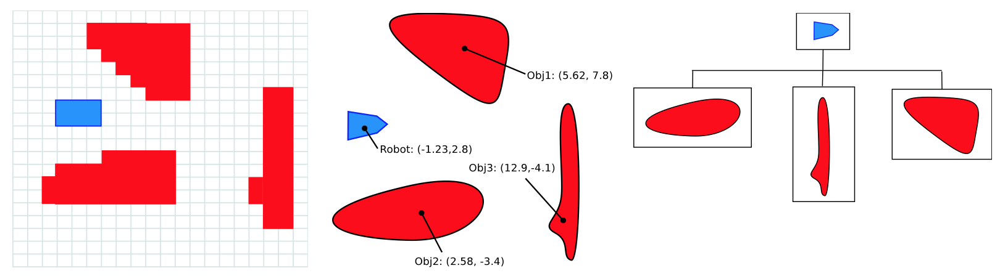

Fundamental Challenges
----------------------

Navigation and Localization
~~~~~~~~~~~~~~~~~~~~~~~~~~~

:index:`Navigation` is the process of routing the robot through the environment.
:index:`Localization` is the process of determining where the robot is in the
environment. Most of the robots we imagine can move around. So, we
expect that a mobile robot can navigate its environment. This really
seems pretty simple. After all, worms and insects can do it, so machines
should have no problem. Right? Navigation in three dimensions requires
that the robot have a full understanding of the obstacles in the
environment as well as the size and shape of the robot. Determining a
path through the environment may also come with constraints on the path
or robot pose. Typically to route a robot to some location, the current
location is needed. Clearly just moving and avoiding obstacles does not
require any knowledge of location, but there are plenty of times where
the routing and localization problem are intertwined.

.. Image by Roboscience.

.. _`basic-navigation`:
.. figure:: IntroductionFigures/navigation.*
   :width: 90%
   :align: center

   Navigation approaches.  a)  A very simple approach to navigating the robot.  The programmer
   codes in the times and velocities to run the motors for linear travel and
   turns.  b) By instrumenting the environment, for example placing lines or
   grooves on the floor, the robot can successfully navigate.

Navigation requires sensory information. The availability and type of
information is critical to how effectively the robot can navigate or
localize. Having only sensors that measure wheel location makes
localization difficult and path planning impossible. Dead Reckoning is
the method of determining the speed and run times for the motors. Then
repeating this in different combinations in order to navigate the
course. Essentially this is the game that you memorize your steps and
turns and then try to retrace them with a blindfold. Modifying the
environment allows for much better control of the robot but with the
added costs of environment modification, see Figure :numref:`basic-navigation`.
Dead reckoning normally has very poor results due to normal variations
in motors. Environmental instrumentation can be very successful if
available.

.. Owned by RoboScience

.. figure:: IntroductionFigures/localization.*
   :width: 85%
   :align: center

   Localization can be very difficult. In this example, a LIDAR scan is
   compared to a known map to deduce the location of the robot.

The approaches and algorithms are based on the underlying
representations of space. We can represent space as a grid, or a
continuum or an abstract system, Figure :numref:`fig:maptypes`. Each method will
determine the way we index the object (integers or floating point
values), the resolution on location and the algorithm for accessing the
object. We could also represent space in a discrete manner. This makes
grid based approaches available. Space could also have a graph
structure. The algorithms to navigate then will use or exploit these
different ways space is represented. The differences give rise to
different performance, accuracy, and results.

.. Owned by RoboScience

.. _`fig:maptypes`:

   An example of different map types.

Although challenging, navigation is a core skill in mobile robotics.
Autonomous navigation is a focus for many industries. Farming is looking
at conversion to autonomous machines as well as autopilot systems for
automobiles. Of great current interest is a vision based autopilot
system, Figure :numref:`fig:visionautopilot`. This is an active area of research
and we touch on it in the next section.

.. This is not verified as public domain

.. _`fig:visionautopilot`:
.. figure:: IntroductionFigures/bosch.*
   :width: 90%
   :align: center

   Vision based driver assist system (Bosch).

Vision and Mapping
~~~~~~~~~~~~~~~~~~

For many of us our dominant sense is vision and we have readily
available sensors - the camera. Cameras can be much more sensitive than
our eyes as they can deal with a greater intensity and frequency range.
For all of the improvements in digital imaging, processing all of that
data into a meaningful information is still a significant challenge. One
of the major goals in computer vision is to develop vision systems
modeled after our own capability.

.. Public domain

.. figure:: IntroductionFigures/vision_redobjs.*
   :width: 90%
   :align: center

   For humans, it is very easy to distinguish
   apples, tomatoes and PT balls, but has presented considerable
   challenge for machine vision systems.

.. Public domain

.. figure:: IntroductionFigures/road.*
   :width: 90%
   :align: center

   It is easy for a human but hard for a computer to track the road
   in a variety of lighting conditions and road types.

With the rise of convolutional neural networks (since 2012), we have
witnessed dramatic improvements in computer vision. The field is
commonly known as deep learning and is addressing some fundamental
problems in vision as well as a host of other applications. Advances in
deep learning are starting to impact robotics and will significantly as
times goes.

**Mapping**, in robotics, is the building of a representation of the
robot’s environment. The assumption often made is that either a map is
available or not required. In some cases a map is required, but not
available. If the application is surveying, the map is the goal. When
reasonable localization is present, mapping just follows from the
onboard sensors. If range sensors are available, then a map can be
produced by knowing the location of the sensor (we assume the relation
between the robot and its sensors are known) and the range data to
objects. A map can be produced as the robot moves about the environment
collecting the data. Again, the details on how this is done is dependent
on the environmental representation (such as metric versus grid maps).
The details are also affected by the accuracy and resolution of the
sensing system.

If location is not known, but the sensors do provide some metric or
range information, then mapping is still possible. SLAM, Simultaneous
Localization and Mapping, is the process to determine the local map as
well as the robot’s location on the map. We will discuss SLAM later on
in the text.

An interesting *chicken and egg* problem arises. Map building requires
knowledge about localization. Conversely, localizing a robot on a map
requires a map.

- If I have a map, then I can figure out my location from landmarks.
- If I know my location, then I can build a map.
- If I don’t know where I am and I don’t have a map ..then..?

.. Owned by Roboscience

.. _`intro-slam`:
.. figure:: IntroductionFigures/path_todest.*
   :width: 90%
   :align: center

   SLAM: Simultaneous Localization and Mapping

When a robot enters an unknown environment, neither the map of the
environment for the location of the robot on the map are understood.
These two processes must occur together, simultaneous localization and
mapping. This is done often enough that it has a name: :index:`SLAM`
(:numref:`intro-slam`:). The 2D SLAM problem has been well addressed for interior
environments, however 3D SLAM is an active area of research.

.. Public domain

.. _`intro-slam-problem`:
.. figure:: IntroductionFigures/slam.*
   :width: 90%
   :align: center

   Localization and Routing:  a) How does the robot know
   where it is?  b) Hard to plan a route if location is unknown.

There are limits of course. It is possible to confuse any SLAM system.
Generally, if humans cannot map or localize, then expect the robot
cannot either. Consider highly repetitive environments or featureless
environments, Figure (:numref:`intro-slam-problem`); it is easy to see how a
vision system could get confused. These are special cases where there is
very little information available however and we don’t expect the vision
system to perform without adequate data.

.. Public domain

.. figure:: IntroductionFigures/mazeforest.*
   :width: 90%
   :align: center

   Compare the structure of a maze to that of a forest scene. Very simple
   robots can plan a route and escape a maze. Routing through random obstacles
   in three dimensions is still very difficult for a robot.

If the robot knows the environment, either from a successful application
of a SLAM algorithm or predetermined in the case of industrial robots
with structured workspaces, then it is reasonable to ask about planning
motion which is optimal in some sense. The field of planning is
interested in deriving motion paths for articulator arms or mobile
robots, Figure (:numref:`intro-slam-problem`). The environment will have
obstacles, the robot will have constraints, and the task will have
certain goals. Based on these requirements, the system attempts to
compute a path in the environment or working space that satisfies the
goals.

It is interesting to note that tasks which are easy for humans can be
hard for robots and tasks which are hard for human may be easy for
robots. Meaning tasks with lots of structure and rigid environments, the
robot can succeed and maybe succeed better than a human. Other tasks
which lack structure for which humans are quite adept, the robot may not
succeed at all.

Robot Control
-------------

Assume that you want to build a robot that can deliver mail to the
residents in a elder care facility. This is akin to the drug delivery
robots in hospitals. The halls are straight and corners are 90 degrees.
The layout does not change much over time and the build plans are
available before the robot goes into service. The first temptation would
be to try a form of dead reckoning. Of course it is clear that the
wheels and motors are not ideal or identical. Drift will occur. The dead
reckoning approach, meaning an approach which does not take in position
information is known as open loop control. The open refers to not having
feedback. Open loop control has problems with drift.

To address this problem the system will gather information from sensors
and use this information to update the position. Meaning it will correct
for drift. Not that we are completely stopping the drift since error
will creep in and we cannot eliminate this. However we can adjust the
system and hopefully compensate enough to navigate successfully. Using
the feedback is known as closed loop. It is more complicated than open
loop control but necessary for real world position control.

When one designs and builds a robot, it is natural to focus on the
intended abilities. We think about having the robot perform some set of
tasks. After laying out what the robot should do and what sensory data
it needs, then we tend to think about how we will coordinate those
activities. The coordination of the activities is an important element
in the system design. Much of the way the robot behaves can be traced to
the coordination approach used. There are two ways to proceed here; one
based on a classical artificial intelligence approach and ones based on
newer methods in artificial intelligence.

.. Owned by Roboscience

.. figure:: IntroductionFigures/Control.*
   :width: 90%
   :align: center

   Control system for a simple navigation system which fuses odometry
   and sonar.

For the classical methods we need complete modeling of the system in the
environment. Typically this is a complete mathematical model of the
different ways that the robot moves: kinematic model, control inputs,
environment description, etc. The approach is then function based and
follows a sequential decomposition of the tasks, see
Figure :numref:`robotcontrolclassical`:. Independent of how things operate “under
the hood”, we tend to view these systems as interacting with the
environment using a four stage conceptual framework :numref:`fourstage`.

.. Owned by Roboscience

.. _`robotcontrolclassical`:
.. figure:: IntroductionFigures/classicAIcontrol.*
   :width: 70%
   :align: center

   A more traditional approach to robot control.

Most of the time the developer will want to code up the robot behaviors.
This may involve a set of actions or reactions to events. They can be
simple rules sets, or finite state machines or very complicated expert
systems. The goal is to impart the robot with enough machine
intelligence so that it can operate in the environment which it is
deployed but keep the code simple enough to run on the onboard
processors. For example, a number of years ago, one of the authors used
a state machine for a simple exploration robot :numref:`intro-statemachine`. In
this case the decision process is completely defined before the robot is
sent out.

.. Owned by Roboscience

.. _`fourstage`:
.. figure:: IntroductionFigures/new_old_AI_blend.*
   :width: 70%
   :align: center

   A more traditional approach to robot control.

.. Image by Hoover & McGough
.. _`intro-statemachine`:
.. figure::  IntroductionFigures/StateMachine.*
   :width: 50%
   :align: center

   A finite state machine for an exploration robot.

The Prussian general Helmuth von Moltke the Elder has been paraphrased
in “No battle plan ever survives contact with the enemy.” This is
certainly true for the preprogrammed robots. Unless in the situation of
an industrial robot which has as consistent environmental presentation,
the issues in the natural world are overwhelming. Beyond things like
noise and drift are unexpected objects or events in the world around the
robot. The programmer is hard pressed to anticipate, design and program
for all the contingencies. The sensors can be inconsistent or
unreliable. All of this leads to difficulties in obtaining accurate
position/orientation estimates.

From early in its history, engineers have been dealing with the vast
separate of the perfect world in one’s mind and the messy dirty world we
live in. Tools such as digital signal filters like the Kalman Filter
aimed at cleaning up sensor input or higher fidelity motor encoders to
increase accuracy and resolution have been, and still are, widely
embraced. Fuzzy logic or Bayesian based algorithms gave some measure of
robustness, with the latter being exceptionally effective at dealing
with uncertainty. Recent state of the art systems are a bundle of Sigma
Point Kalman filters, Markov localization algorithms, motion planning
and goal determination routines, actuator control codes, glued together
by some type of interprocess communication. All of this is supported by
some modern OS and middleware.

For fully autonomous mobile robots, such as seen in planetary
exploration, it is impossible for the system designer to anticipate all
of the situations the robot will find itself in. Even when we can
anticipate, we tend to think and use language with significant lack of
precision. This allows us to say things like “drive to the gas station,
turn left and head up until you see ...”, which are easy to say but very
hard to program. Increases in data, mission scope, environment means the
computational task increases at a geometric rate. To address this, we
turn to lessons learned in the biological world. Clearly evolution has
solved these problems in nature and so we engage the tools of natural
computing to solve the problems in robotics. It has been said that the
killer app in artificial intelligence is robotics. Although I believe
this to be true, given the difficulty in defining a robot, the statement
is mostly a catchy one liner.

Google, Nvidia, Amazon, Facebook all have embraced some form of machine
learning as critical to their futures. Some of these approaches are
statistical, but many are biologically motivated. For example,
convolutional neural networks and reinforcement learning are two very
current popular approaches in machine learning. Neither is new, but has
benefited from years of research in algorithmic tuning and massive
increases in hardware performance. The connectionist approaches tend to
be highly parallelizable and see dramatic improvements in performance on
GPUs, FPGAs and DSP hardware (TPUs). Thus modern robot control
architectures see a parallel decomposition of the elements in the
sensing, cognitive and actuation stages of the control algorithm and
reflect the biological roots, see Figure :numref:`robotcontrolnewer`.

.. _`robotcontrolnewer`:
.. figure:: IntroductionFigures/newAIcontrol.*
   :width: 70%
   :align: center

   Newer approaches parallelize the control architecture. The details of
   the final fusion step are discussed later.

The strengths of these new machine learning tools are in the ability to
learn, the robustness to faults and errors, as well as a much reduced
human design. Rules or patterns are not programmed in. Cases, especially
edge cases need not to be defined. Kinematic models can be dispensed.
Digital Signal Filters and sensor fusion models may be removed. Having a
system which can learn can by orders of magnitude reduce development
hours for a specific system. The machine learning methods we will
examine in later chapters will mostly be based on biology, specifically
on neural networks or behavioral learning theories.

Sense, Plan and Act
~~~~~~~~~~~~~~~~~~~

Robin Murphy in her text *AI
Robotics* :cite:`Murphy:2000:IAR`, discusses the fundamental
processes that robots must have. Sensors gather information about the
environment surrounding the robot. A control system takes in the sensed
information, merges it with knowledge contained within and plans a
response, then acts accordingly.

The sense, plan, act architecture was the obvious first attempt at
control. Sensory data is received and processed into sensory
information. For example a laser ranging device returns raw data. This
raw data is processed into a distance map. The distance map might be
corollated with an existing environment map. Using the map information
the system can plan a response. This could be a trajectory for the robot
or robot manipulator. Once the response is decided, the system would
determine how to engage the actuators to gain the desired response using
the kinematics models for the system.

Few, if any, biological systems operate this way. Biological systems
react to stimulus more directly. There is a sense-act architecture that
is in place. For a particular sensory input, a predetermined action is
defined. This reflex system can be fast and effective. The limitations
are obvious. The responses to the environment need to be predetermined.
General purpose robots or robots in new environments cannot use this
approach. Often the situation requires more complex responses which need
planning that takes into account local data.

Hybrid approaches can be built from the sense-act architecture. Murphy
describes a plan, sense-act approach. The robot will plan out the task
and then embark on the task. During execution, the robot will work in a
sense-act reactive mode while carrying out the plan. These ideas are
abstractions and we will have opportunity to see how each can play out in
detail when we look at more complicated tasks.

**Bugs, bats and rats**

The natural world is simply amazing. It is filled with incredible
solutions to some very difficult challenges and the engineering has
often looked at the natural world for ideas and insipration. An ant is a
very simple creature which manages to survive all around the world in a
vast array of environments. Ants can navigate large habitats with local
sensing only (that we are aware of currently). We can use these small
creatures as a model for some basic path planning and navigation. It is
not our goal to imitate the natural world and so we make no attempt at
an accurate insect model. For our purposes a generic “bug” will suffice.

All of us have watched ants wander the landscape. I often wonder how
they actually manage to cover such large distances and return to the
nest. Ants have three very important senses - touch, smell and sight
(ants can sense sound through sensing the vibrations and so we lump this
into touch). The sense of smell is very important for ants. They use
pheromones to leave markers. In a sense, ants are instrumenting the
landscape. As we will see this is similar to the Northstar style
navigation systems used in many commercial systems.

Touch based navigation is the most elementary approach to sensory
system. It can be used in conjunction with chemical detection or taste.
Although possible for robotics, we will not discuss chemical detection
sensors here. Another approach is to use sound. We use sound in a
subconscious manner as a way to feel the room. It is an extension of
touch. We infer hard or soft surfaces as well as room size. This is a
passive use. An active use would be listening to our own voice. The
feedback gained again give us some information about our surroundings.
The most active use commonly illustrated is by bats and dolphins. They
use sonar which gives them obstacle avoidance when vision is inadequate.
Sensing using sound is easier than using light or radio waves due to the
slower propagation speeds. Basic distance sensors using sound are
inexpensive and readily available so many robots have successfully
employed them for use.

We tend to use animals as models for robot capability. Placing a rodent
in a maze was done early on to test memory and learning skills. It gives
a benchmark to compare robot and animal capability, as well as providing
a comparison.

Transparency and Verbalization
~~~~~~~~~~~~~~~~~~~~~~~~~~~~~~~

When we send an autonomous machine out to perform some task, we may need
information from the robot about the details and decisions that occurred
during the task.  We may need to know why the robot was late on arrival
or why it did not retrieve the requested item.  Or maybe we need to know
updates on the environment that was just sensed.  The concept of transparency
is to provide the humans interacting with the robots the information about how
the task was performed just like we do with each other.  For example, when
a friend says "sorry I am late, I was delayed by traffic".

Robots are capable of logging everything. All of the
sensory data, the internal and external configuration data, decisions based
on that data and so on.  All of this is stored in large files populated
by numbers.  For humans this is not very useful.   Imagine your late arriving
friend giving you a gigabyte of data that contains freeway traffic density
and velocities of 50 millisecond samples.  We want our robots to convert this
into human terms.  We want the robot to say "due to high volume of cars, the
traffic slowed down and I was delayed."   This is known as verbalization.
It is an application of natural language processing applied to the data logs
in the robot.   It is an active but important intersection of co-robotics
and machine learning.

Self Driving Cars
~~~~~~~~~~~~~~~~~~

Although self-driving cars really fits as part of the previous discussion,
we would like to address it specifically here.  Of all of the robots
that the population will encounter over the next decade, it is the
self-driving vehicle that will be most common.   We already have robotic
vacuum cleaners in the home.  Having a humanoid robot in home is still
outside current technology.  Not everyone will interact with manufacturing
robots either.  But automobiles are everywhere and a good example to
illustrate the concepts presented in this text.

According to  `asirt.org` 1.3 million people globally die in automobile accidents
each year.  Another 20-50 million are injured. Globally it sits in the top
10 causes of death.   It is expected that the numbers will rise of the next
couple of decades.    The population is increasing and so is population density.  Not only does
this increase accidents, it increases travel time.   Commute time to work
is significant for some cities and occupations.

Automation of the vehicle has promise to address both of these concerns.
The system will not get drowsey, intoxicated, distracted, or angry.  This
has clear potential to reduce accidents.  The driver is freed to focus
attention on other activities during the commute.
Individuals who have issues that prevent them from driving can now commute
and are no longer hostage to external services.  Cars that can communicate
with each other are able to smooth traffic flow, increase flow rates and
provide early warnings to other vehicles when dangers are detected.

Self-driving cars have a long history.   In the 1950s GE imagined vast
highway systems that automated travel.  In the mid-1990's Mercedes experimented
with driverless technologies and achieved some impressive results.
The public started to hear more about autonomous vehicles with the DARPA
Grand Challenge.

Fast forward to today and we have virtually every auto manufacturer working
on some level of autonomy for their products.  We now have hundreds of thousands
of miles traveled in a variety of conditions.  Clearly highway miles are the
easiest, but we have successes in cities and other dense obstacle rich locations.

What is needed to self-drive?
Here are the steps:

* Sense the surroundings
* Model the environment
* Find vehicle location and pose
* Plan action
* Execute action

.. figure:: IntroductionFigures/selfdriving.*
   :width: 95%
   :align: center

   Software chain for self-driving cars.

The sensor we are most familiar with is the camera.   The camera produces
a sequence of images for which we apply a series of software techniques
known as computer vision.   In the driving application this is how we would
perform lane detection.  It also is part of the road sign identification
system and in general, obstacle identification.

Some classical tools can be used, but the state of the art is moving towards
using Deep Neural Networks (DNNs) and specifically Convolutional Neural Networks
(CNNs).  For example, we may feed a DNN lots of various road sign images so
the network learns to recognize stop signs, yield signs, route markers and so
forth.

A very critical task is lane identification.   Through a series of standard
operations the bounding lines of the lane are extracted from the road image.
The midline of the lane is estmated for later use in driving the car.

A single camera is a fabulous sensor, but there are some really critical things
that the camera cannot do.  Fundamentally the camera is a 2D sensor.  It is not
able to resolve the 3D world, specifically the depths of sensed objects.
It is also unable to
resolve the absolute scale of objects in the image.  If you happen to know
the size of the object, then you can infer the distance based on image
height.  However, this is really only practical in the near field due
to the errors introduced by the pixelated image (more in the computer vision
chapter).

One solution to this would be to use two cameras, known as stereo vision, just
like we do.   One can approximate the two camera concept by moving one camera
around which is known as *structure from motion*.  Limitations in hardware
and computational complexity pushed the industry to try other sensors to
measure distances and velocities directly.

Two popular distance or range sensors are radar and lidar.  They use radio waves
or light to measure the effective distance and through some mathematical techniques
can also determine velocities.   Radar is fairly inexpensive, at least in
comparison to lidar.  Lidar has very high accuracy and can produce millimeter
resolution maps.   Both operate at high data rates.  Compared to lidar, radar is unaffected by
light, snow, rain, fog and other conditions and combined with the lower cost, is
a popular option.

Other systems such as sonar can also be deployed.   Each has pros and cons which
will be discussed in detail in the sensor chapter.   In addition to ranging
sensors, the vehicle will have a collection of other devices
that perfom direct measurement of wheel speeds, have knowledge
of orientation through a compass, know forces through an accelerometer, rotation
rates through a gyroscope and position using a high accuracy GPS.

That said, we now have significant amount of information.  Some of this
information is redundant.   That is a good thing since we can use the
redudancy to increase our accuracy.   This process is called sensor fusion.
We can deduce the current state of our vehicle (speed, orientation, etc) by
combining all of these data streams (and even using camera data) with a
:index:`Kalman Filter`.

Using this state information and combining it with a map is how we determine
our location.   If you
have an accurate map with known landmarks, then we can trilaterate to determine
our location.   The localization process can also be done with modifications of the
Kalman Filter or using another tool known as the :index:`Particle Filter`.

At this stage in the pipeline, we know where we are on the map and where we are on the
road (recall the computer vision aspect).   The lane detection algorithm
will tells us about road curvature, obstacles, other vehicles and their states
and so forth.  Other modules would be predicting collisions with other moving or
stationary objects.

Next we need to look at our goals and compare to our current state.  We may want
head to a certain location, avoid other cars, stop at stop lights, and obey
other traffic laws.  So the motion planning system or path planning code will
determine the next course of action.  This would be desired velocity, turn angle,
and braking.

Those motion decisions are sent to the servo and motor controllers which will
translate the coded signals into higher voltage electrical power.  Sensors
measure the response and the controller adjusts to get the desired result.  This
is known as controls and is our final step in the pipeline.
This is all there is, although the elements of a real system
may be more complicated they are essentially the elements described above.
