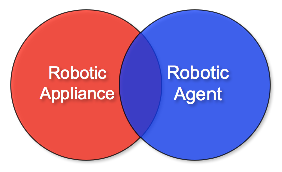
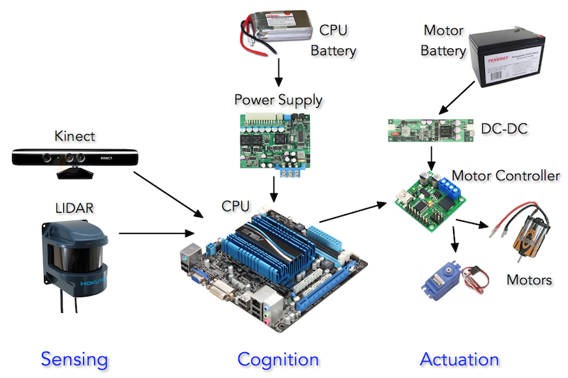
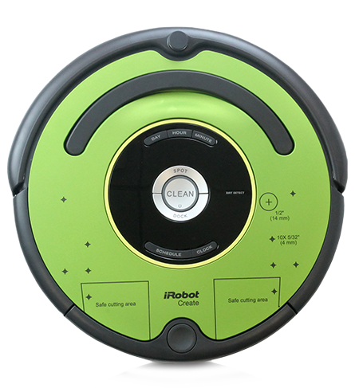
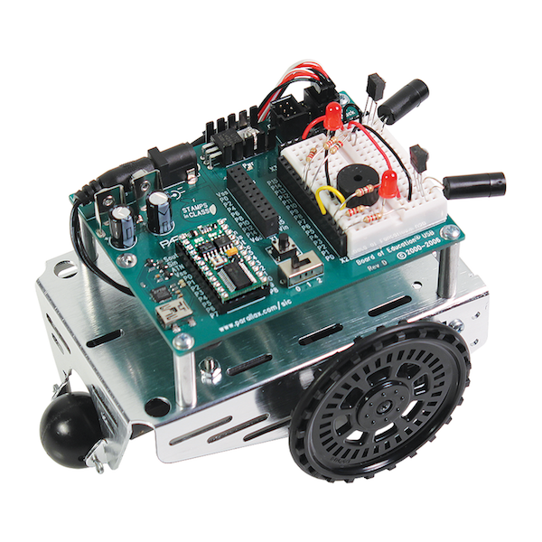

An Overview
-----------

Robotics as a discipline is often described as an interdisciplinary
field constructed from Mechanical Engineering, Electrical Engineering,
Industrial Engineering and Computer Science. It is fairly new as an
academic area and mostly grew out of Mechanical or Electrical
Engineering programs. Previously, various aspects of the robotics trade
was found in subjects such as kinematics, dynamics, controls,
mechatronics, embedded systems, sensing, signal processing,
communications, algorithms and planning.

.. This figure is owned by RoboScience

.. figure:: IntroductionFigures/overview.*
   :width: 70%
   :align: center

   Robotics is a blend of mechatronics, embedded systems, controls,
   sensing, signal processing, kinematics, dynamics, communications,
   algorithms and planning.

Application domains for robotics is a quickly growing list. We are quite
used to seeing robots in large industrial settings like automotive
manufacturing and palletizing. They have made a name in welding,
painting, inspection, product loading, parts placement and a variety of
other industrial tasks. Hazardous environments (space, underwater,
chemical/nuclear, military) are a significant growth area for mobile
robotics. Applications that manipulated radioactive materials, toxic
chemicals and other hazards have been prime choices for teleoperated
systems since the human operator can be kept safely away. During flu
season, the workplace can be considered a hazardous area and
telepresence can address the issue. A recent version of a standard
teleoperated robot is the surgical robot. This device can follow human
motion but scale it down to be effective in regions where human motor
control is too crude and dangerous. It is like having a gear reduction
in motion leading to more precise and accurate manipulation.

Roboticists often view robots as systems comprised of three components:
**Sensors, Software and Effectors**. In other words, there is
**perception, cognition and actuation**. One could break a text down
into those three major components. Although it has a certain taxonomic
appeal, the reality is that these aspects are intertwined and should be
studied together.  We are finding that in robotics, they must be integrated.

A simplistic taxonomy
~~~~~~~~~~~~~~~~~~~~~

To get started, we use a rather crude taxonomy of robots: **mobile
robots** and **industrial robots**. The mobile systems are best known
through examples like the NASA Rovers and the IED detecting robots of
our armed forces. Industrial robots have been in use for a half of a
century and are well known in manufacturing and more recently with
surgical robots. Typical examples are shown in
Figure :numref:`fig:fixedvmobile` .

.. First image is public domain, second is owned by SDSMT UAV.

.. _`fig:fixedvmobile`:
.. figure:: IntroductionFigures/factory-drone.*
   :width: 90%
   :align: center

   A contrast in uses.  a) The traditional factory setting for robotics, Kuka robotics.  b)
   An autonomous helicopter releasing an autonomous quadrotor - SDSMT UAV Team.

It is important to note that partitioning these machines into two
categories ignores the full spectrum of systems available. As the
application areas grow, this distinction will vanish. However, it is
useful at the moment to illustrate some concepts. Useful in that we are
able to isolate various challenges and technologies in existence. Later
we will dismiss the artificial categories and look at mobile autonomous
systems in unified manner.

Robotics built a name in manufacturing. The ability to repeat a task
exactly for thousands or hundreds of thousands of times is essential to
take advantage of scale. It enables a market advantage by keeping
assembly costs down. This may be due to human labor costs, human speed,
human error, human environmental restrictions or some combination.

Thus industrial systems grew out of the need to do a specific task
quickly, accurately and cheaply. These systems live in an instrumented
and structured environment. The task, the interaction between robot and
objects, is understood and predetermined. Highly accurate positioning
for tools, exact tool paths and application of specific tool forces
dominated the designs.

Contrast this view with the mobile machine. By its very intent, this
device leaves the confines of the lab or shop. It moves into new and
possibly unexpected environments. Lack of instrumentation outside the
lab and lack of pre-determined structure removes any possibility of
predetermined interactions. They must be novel and thus requiring a
great deal more from the system. The possible types of interactions are
enormous and as such the machine must not be specifically programmed,
but must be a generalist. Although the precision of interaction and
speed of task may be greatly reduced, the increase in complexity for the
system in the new untamed world is much more complex. It requires
behaviors that mimic intelligence. It is in this arena that computer
scientists can contribute best. The contrasting elements are given
in :numref:`table-fixedvmobile`.

.. _table-fixedvmobile:
.. table::  Typical aspects of Mobile vs Manufacturing Robots.
   :align:  center
   :widths: auto

   +--------------------+------------------------+
   | Manufacturing      |    Mobile machines     |
   +====================+========================+
   | Dedicated          |    General             |
   +--------------------+------------------------+
   | Fixed environment  |   Changing environment |
   +--------------------+------------------------+
   | Predetermined tasks|   Adapting tasks       |
   +--------------------+------------------------+
   | Fixed interactions |   Novel interactions   |
   +--------------------+------------------------+

A less simplistic view
~~~~~~~~~~~~~~~~~~~~~~

The *industrial robot* verses *mobile robot* is one way to partition up
the robot design space, but is one that really does not do justice to
the vast array of creative designs which have emerged. Robots are
machines which help reduce human effort in some manner. We create them
to assist us. Understanding robots in terms of how they are used or how
we interact with them, although rather human centered, is another way to
classify these machines. It is also a way to classify newer systems that
don’t really fit into one of the two boxes described above.

Take, for example, the new surgical robots. These systems are not
mobile. They share many attributes of the industrial robotics designs.
However, these systems operate (pun intended) in a vastly dynamic
environment since no human is the same. These systems are not performing
repetitive tasks but are carefully controlled by the surgeon. A similar
issue arises when you examine the current class of telepresence robots.
They are not autonomous and are confined to simple office environments.
So how should we understand these systems as robots. Or are they?

Let’s try a thought experiment. Say you are a surgeon. The scalpel is
directly controlled by the surgeon’s hands and eyes. That instrument can
be placed on a rod to access difficult regions. Maybe a long linked or
flexible rod. To see in the hard to access regions, we can place a small
video camera. We bundle and run the camera and scalpel through linked
rods and cables. Instead of controlling the position of these
instruments by hand, we decide to control using servos. Because we are
not using our hands to control, we have lost the “feel” of the
instrument interacting with the tissue, so we add some types of feedback
in the grips. We now have a surgical robot. But where did it cease being
a tool and become a robot?

Surgical robots, telepresence robots, and remotely piloted drones all
extend human capability. They extend our reach and our senses. They can
operate autonomously in the limited sense of physical separation from
the human, but not without constant direction. Although they can be very
sophisticated, they are automatons or appliances. We will use robotic
appliance to describe this class of robots which is an extension of us
and not worry so much as to their construction or mobility. Simply that
they are not collaborators with us; merely extensions of the pilot. The
classic industrial robots, cleaning robots and 3D printers easily fall
in this category. Pre-programmed systems extend our work hours by
replicating the programmer’s first successful (remote) run.

The efforts you see with the PR2 or the Baxter show a different trend.
These are robots that are collaborators. They work with us, maybe beside
us, but semi-autonomously. This means that they are not simply
reflecting our directions, but are adding something to create a team and
ultimately something greater than the sum of the parts. These robots are
agents acting independently to some degree. Home care robots and
autonomous vehicles are two such examples. The rise of robot agents is
strictly due to the recent successes in machine learning. It is the new
forms of artificial intelligence that are making robotic agents a
reality, and appears to be in a rapid growth phase.

.. This figure is owned by RoboScience

   Another way to view robotics.

The value of classifying is to help one understand the landscape. Its
utility ceases the moment it restricts innovation. So we will leave the
classifications behind us and refer to them only when required.

Electronic components of a small mobile robot
~~~~~~~~~~~~~~~~~~~~~~~~~~~~~~~~~~~~~~~~~~~~~

It is useful exercise to open up a small mobile robot and become
familiar with the hardware. There has been an explosion in options for
robotics. Low cost microcontrollers are immensely powerful. There is an
ever growing list of sensors, actuators and support electronics. This is
very helpful for the computer scientist since one no longer needs custom
equipment to get a mobile system operational. Using USB interfaces, it
is possible to connect the various systems just like we do with Legos.
(Later we will note that USB may not be the best choice due to
electromagnetic interference.) Before we get any further, however, lets
go over the basic terms we need to know for this section.

Manipulator
   the movable part of the robot, often this is the robotic arm.

End Effector
   the end of the manipulator.

Actuator
   the motor, servo or other device which translates commands into motion.

Sensor
   any device that takes in environmental information and translates it to
   a signal for the computer such as cameras, switches, ultrasonic ranges,
   etc.

Controller
  can refer to the hardware or software system that provides low level
  control of a physical device (mostly meaning positioning control), but
  may also refer to the robot control overall.

Processor
  the cpu that controls the system. There may be multiple cpus and
  controllers or just one unit overall.

Software
   all of the code required to make the system operate.

.. Image by Roboscience.

.. _`intro-components`:

   The small mobile robot illustrates the three aspects of
   robotic systems: sensing, computing and actuating.

:numref:`intro-components` shows the basic hardware elements of a typical
low cost small mobile robot. We can see sensors, software and effectors
in this unit. There are two sensing systems described in Figure
:numref:`intro-components`. The familiar sensor is the Microsoft Kinect. The
Kinect is a type of sensor known as a ranger which is any device that
provides distance or range information. It also has a built in camera
which is integrated with unit. The depth sensor returns an array of
distances that are registered with the the pixels in the camera image.
This is very useful because you then have a distance approximation for
features seen in the image and have both 3D reconstruction and color
mapping for a scene.

The second sensor found on this unit is the LIDAR. This is a laser
ranging unit. It does a horizontal sweep (the pictured unit sweeps
roughly :math:`240^\circ` arc) and returns the distances along the arc.
The LIDAR only returns depth information along the arc so can only give
a cross-section of the scene. Placing the LIDAR on a pan or tilt system
then can scan a region if required. Many human environments are just
extensions of a 2D floor plan into 3D by extending the vertical
direction and so a LIDAR is a very useful ranging device.

A camera can be a useful sensor and paired with a second camera the pair
can provide depth of field. Stereo vision for robots works on the same
principles as stereo vision in humans. Since the Kinect does not operate
in sunlight, a stereo camera setup is a cost effective alternate to more
expensive ranging equipment. Other inexpensive approaches use a type of
sonar. An ultrasonic transducer can send a chirp. Knowing the speed of
sound one can determine the distance of an object in front of the sonar
unit.

Simple sensing systems can detect touch or impact (bump sensors for
example). Sensors are available to measure pressure and force. These are
important in manipulation where the object is fragile relative to the
robot gripper. There is a vast array of sensors available measure light,
radiation, heat, humidity, magnetic fields, acceleration, spin, etc.

Popular Hobby Robots
~~~~~~~~~~~~~~~~~~~~

   iRobot Create (image from iRobot).

- :index:`iRobot Create` This robot based on the iRobot Roomba, was introduced
  in 2007 and has been used as a platform for many ground robotics projects.
  Most notably is the Create was the base for the ROS based research robot,
  the turtlebot.  In 2014 the Create 2 was released.  Unlike the Create,
  the command module was not updated and made available, the create 2 assumes
  that the robot will be controlled via an Arduino or Raspberry Pi.

   Parallax Boe Bot (image from Parallax).

- :index:`Parallax` :index:`Boe Bot`  Parallax has been in the educational
  and hobby robotics business since 1987.  The Boe Bot is based on an early
  electronics education board, BOE (Board of Education).  This board used
  a chip that supported the BASIC programming language.  The Boe Bot robot
  chassis design has been very popular due to its robustness and versatility.

.. Note:: Add additional robots

Autonomy
~~~~~~~~~

:index:`Autonomy` or :index:`Autonomous` appears quite often in the current press. What
does this mean? Dictionary.com will define this as “acting independently
or having the freedom to do so”. We should be careful to distinguish
autonomous (and probably autonomy) from automated. The root meaning of
autonomy is self-governance verses the idea of automated which is “to
make automatic". Although similar in sound, automatic carries the sense
of preprogrammed or pre-sequenced. The difference being that autonomy
hints at using information from the environment, making decisions to
arrive at some goal, but not programmed in a fixed set of actions.

In common usage, we see autonomous and unmanned as inter-changeable.
Whether or not a person is involved, the idea is that the system can
operate successfully without human guidance. However, a self-driving car
is a significant challenge and the industry is looking at partial levels
of autonomy as achievable goals in the near term. SAE has released
definitions of levels of autonomy for automobiles. This is strictly a
characterization for commercially available ground vehicles. These are
intended to provide a common set of definitions for the industry. A
description of these levels can be found at the :index:`NHTSA`
(<https://www.nhtsa.gov/technology-innovation/automated-vehicles-safety>).

+-----------+--------------------------------------------------------------------------------------------------------------------------------------------------------------------------------------------------------------------------------------------------------------------------------------------------------------------------------------------------+
| Level 0   | The human driver does all the driving.                                                                                                                                                                                                                                                                                                           |
+-----------+--------------------------------------------------------------------------------------------------------------------------------------------------------------------------------------------------------------------------------------------------------------------------------------------------------------------------------------------------+
| Level 1   | An advanced driver assistance system (ADAS) on the vehicle can sometimes assist the human driver with either steering or braking/accelerating, but not both simultaneously.                                                                                                                                                                      |
+-----------+--------------------------------------------------------------------------------------------------------------------------------------------------------------------------------------------------------------------------------------------------------------------------------------------------------------------------------------------------+
| Level 2   | An advanced driver assistance system (ADAS) on the vehicle can itself actually control both steering and braking/accelerating simultaneously under some circumstances. The human driver must continue to pay full attention (“monitor the driving environment”) at all times and perform the rest of the driving task.                           |
+-----------+--------------------------------------------------------------------------------------------------------------------------------------------------------------------------------------------------------------------------------------------------------------------------------------------------------------------------------------------------+
| Level 3   | An Automated Driving System (ADS) on the vehicle can itself perform all aspects of the driving task under some circumstances. In those circumstances, the human driver must be ready to take back control at any time when the ADS requests the human driver to do so. In all other circumstances, the human driver performs the driving task.   |
+-----------+--------------------------------------------------------------------------------------------------------------------------------------------------------------------------------------------------------------------------------------------------------------------------------------------------------------------------------------------------+
| Level 4   | An Automated Driving System (ADS) on the vehicle can itself perform all driving tasks and monitor the driving environment - essentially, do all the driving - in certain circumstances. The human need not pay attention in those circumstances.                                                                                                 |
+-----------+--------------------------------------------------------------------------------------------------------------------------------------------------------------------------------------------------------------------------------------------------------------------------------------------------------------------------------------------------+
| Level 5   | An Automated Driving System (ADS) on the vehicle can do all the driving in all circumstances. The human occupants are just passengers and need never be involved in driving.                                                                                                                                                                     |
+-----------+--------------------------------------------------------------------------------------------------------------------------------------------------------------------------------------------------------------------------------------------------------------------------------------------------------------------------------------------------+

There are plenty of very interesting developments in new materials, new
mechanical systems and electrical systems. Recently the options for
mechanical and electrical components has increased to the point that for
many designs, off-the-shelf options are available. This allows for very
rapid prototyping. A system can be assembled quickly so that developers
may focus on the software and it allows much more time on the software
aspect enabling contribution by software engineers. The control systems
are very mature and are done at the lowest levels. This allows the
developers to move to the highest levels of the software. The
interesting questions from a computer science perspective relate to
robot autonomy.

Autonomy is a significant challenge for those who work in robotics and
artificial intelligence. Sensors can easily provide immense amounts of
data. Understanding this data is a completely different and formidable
issue. Thus we arrive at the fundamental distinction between syntax and
semantics. Autonomous systems need to perceive the world, recognize
objects, know their location and plan their
activities (:numref:`intro-autonomy`). Perception of the world around requires
sufficient sensory data to reconstruct the world, but also requires a
conceptualization of the world leading to understanding. Recognition of
objects is essentially the same issue, again requiring
conceptualization. Conceptualization requires a model or framework. A
model is needed for localization and activity planning. Having robust
and flexible models that operate in realtime is a complex task; a task
that we will touch on in detail later in this text.

.. Image by Roboscience.

.. _`trad-challenge`:
.. figure:: IntroductionFigures/tradchallenge.*
   :width: 95%
   :align: center

   The traditional challenge for the software.

.. _`intro-autonomy`:
.. table::  The challenge of autonomy
   :align:  center
   :widths: auto

   +----------------------------------------------+------------------------------------+
   |        **Requirement**                       | **Implementation**                 |
   +----------------------------------------------+------------------------------------+
   | Have a model of the environment              | Maps and Sensor Data               |
   +----------------------------------------------+------------------------------------+
   | Perceive and analyze the environment         | Data filtering and Sensor Fusion   |
   +----------------------------------------------+------------------------------------+
   | Find its position within the environment     | Localization, Mapping, Navigation  |
   +----------------------------------------------+------------------------------------+
   | Plan and execute the movement                | Path planning and Optimal paths    |
   +----------------------------------------------+------------------------------------+

.. This image is public domain

..
.. figure:: IntroductionFigures/RUNSWift_AIBOS.*
   :width: 50%
   :align: center

   Robots in RoboCup, :cite:`Robocup2`

Autonomy presents additional challenges. The environment is very
dynamic. Objects can enter, leave and change shape. The landscape
changes, location and orientation are unsure. However there are more
subtle issues. Think about how the day progresses. The light changes as
with the angle of the sun. There might be changes in natural versus
artificial light. As the robot moves, the perspective on objects change.
For example, look at your coffee cup (or tea cup ...). As you rotate the
cup, the handle can slip out of view. Now we see a cylinder and not a
mug. Without higher order cognitive functions like object permanence,
the object has changed type.

Modeling the environment is difficult. There are no simple ways to do
this. You may have a compact representation, but the enormous storage
requirements brings large computational complexity. For example, you
might decide to use a simple grid system to mark areas of occupied or
free space. Say the grid is a cube 4 inches on a side. In a typical
warehouse which is 20,000 sq ft by 15 ft high gives us 2.7 million grid
points to filter through. Larger outdoor domains are not possible with
grid based object referencing and so other more complicated storage
approaches are needed.

Another aspect which makes autonomy challenging is the multitude of
sources of uncertainty. Sensors are noisy devices. At times they seem
more like random number generators than physical sensors. From moment to
moment, the picture that an autonomous system has changes due to the
noise of the sensors. The noise needs to be filtered out while keeping
relevant data and doing so quickly.

Symbiotic Autonomy
~~~~~~~~~~~~~~~~~~~

The thrust has been to
attempt solutions to each aspect of the chain of challenges a
robot will face.   However, current machine learning cannot resolve solutions
to all of the
challenges facing an autonomous machine.   So, to mimic how humans would
address this problem would be to ask another person - either for information
or actual assistance.   Consider a mail delivery robot that needs to operate
in a building with an older elevator.  The elevator has a simple push
button system to call the elevator.    For the robot to move from floor to
floor, we might want to add the ability to the robot to use the elevator.
One solution would be to augment the elevator system to talk to the robot
over wifi or similar.  This would work for one system, but in general since
we cannot go and overhaul all of the elevators. Another approach might
be to add some type of manipulator.  This requires a robotic arm, control
system and vision system.  However a very simple solution is to ask a nearby
human to press the button.  Although this is a simple thing, it illustrates
that a robot does not need all of the expertise and capabilty.  It can ask
the internet, other robots or humans around for information.  It can ask humans
for physical assistance.  We will call this symbiotic autonomy.
