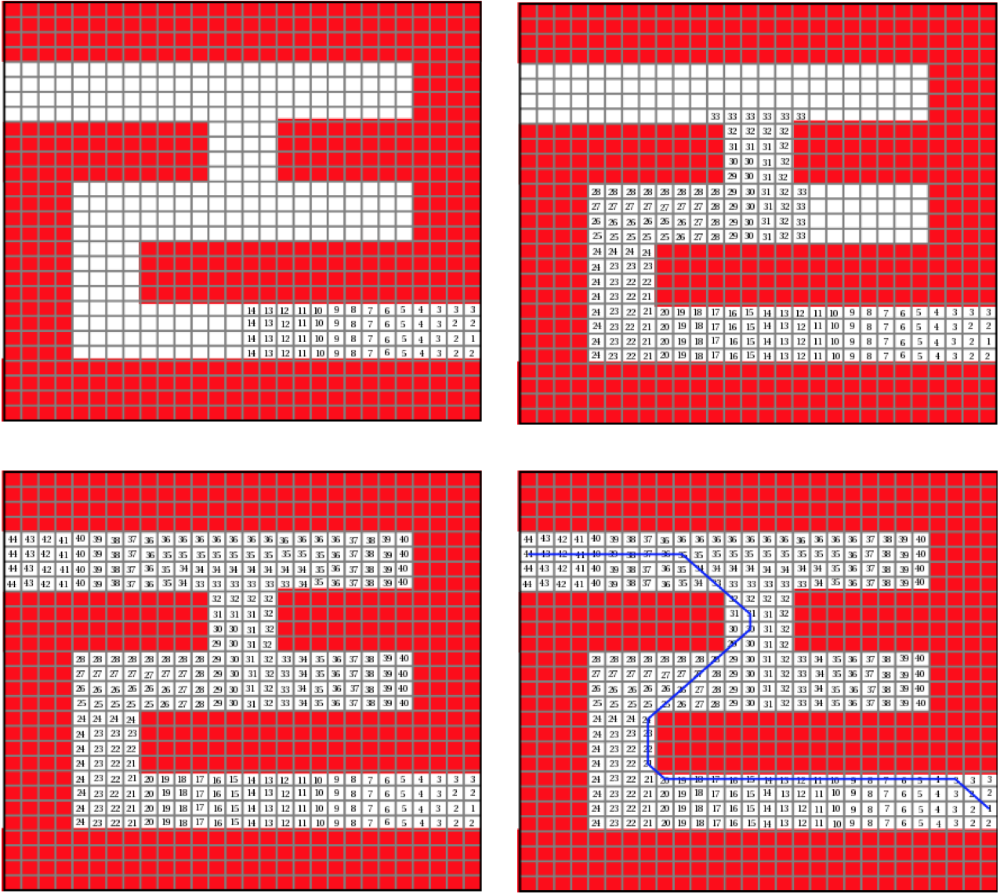

:index:`Wave-front Planner`
---------------------------

In this section we introduce the Wavefront planner. This planner is a
breadth first search algorithm applied to the grid map domain. The
implementation is similar to a flood fill algorithm. The Wavefront
Algorithm searches for the minimal path from start to goal in structured
and unstructured domains,
:numref:`fig:struct_unstruct`. Just like a
flood fill, Wavefront is rather simple. Assume that free space is
represented by white and occupied space is red or black (colored). Zoom
in so you can see the actual pixels as shown in
:numref:`fig:struct_unstruct`.

.. _`fig:struct_unstruct`:
.. figure:: NavigationFigures/floodfillenvs.*
   :width: 85%
   :align: center

   Wavefront will apply to maze and unstructured domains.

The process to find the path through the maze is simple. It is completed
in two stages. Stage one fills the map with distance numbers from the
goal. Stage two steps down the distances until the goal is reached.
Tracking the steps generates the path. So, we have two parts. First is
an algorithm called “Fill” which is like a flood fill in your paint
program. The second part is the “Descent” algorithm. Think of the fill
algorithm as building a hill where the start is at the top and the end
is at the bottom. All we do is walk downhill.

.. _`fig:finemaze`:
.. figure:: NavigationFigures/finemaze.*
   :width: 40%
   :align: center

   Initial Maze.

The Fill algorithm is easy to state. Label the goal pixel “1". Next,
label all unlabeled neighbors of the “1" pixel the number “2". Then
label all of the unlabeled neighbors of the “2" pixel the number “3".
You repeat this process by labeling all of the unlabeled neighbors of
the pixels with the label “k" the number “k+1". Do this until you run
out of unlabeled pixels.

.. _`fig:wavefrontprogress`:

   Wavefront algorithm progress.

The first three images in
:numref:`fig:wavefrontprogress` give you a
few snapshots of the process on a maze. You may note that these numbers
are just the number of pixel steps from your current location to the
goal. It is a travel distance. Next is the Descent algorithm. Starting
at the start point, look around for the pixel with the smallest label or
value. Step there and repeat the process. Continue stepping downhill
until you reach the goal pixel.

.. _`wavefrontbuild`:
.. topic::  Wavefront Label "Fill"

   | Begin at goal pixel.
   | Label the goal pixel 1
   | **repeat**
   |     Label all of the unlabeled neighbors of the pixels with the label "k" using the label "k+1".
   | **until** you run out of unlabeled pixels

.. _`wavefrontfind`:
.. topic::  Wavefront Descent "Path"

   | Begin at start pixel.
   | **repeat**
   |     Pick the neighbor pixel with the smallest label (or value).
   |     Step to that pixel.
   | **until** you arrive at goal pixel.

.. _`fig:wavefillex`:
.. figure:: NavigationFigures/obsmaparray.*
   :width: 40%
   :align: center

   Wave front progression (0)

.. _`fig:wavefillex1`:
.. figure:: NavigationFigures/initmaparray.*
   :width: 40%
   :align: center

   Wave front progression (1)

.. _`fig:wavefillex2`:
.. figure:: NavigationFigures/goalmaparray.*
   :width: 40%
   :align: center

   Wave front progression (2)

.. _`fig:wavefillex3`:
.. figure:: NavigationFigures/fillmaparray.*
   :width: 40%
   :align: center

   Wave front progression (3)

.. _`fig:wavefillex4`:
.. figure:: NavigationFigures/startbtmaparray.*
   :width: 40%
   :align: center

   Wave front progression (4)

.. _`fig:wavefillex5`:
.. figure:: NavigationFigures/btmaparray.*
   :width: 40%
   :align: center

   Wavefront fill example complete.
