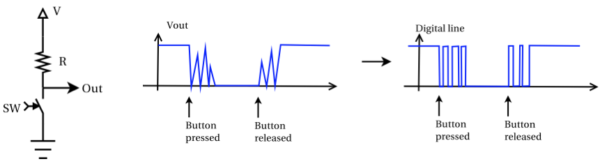

Proximity Sensors
-----------------

Switches
~~~~~~~~

The most elementary sensor available is a switch and commonly used as a
bump or contact sensor on a robot.
:numref:`switchdebounce1`-(a) gives the
schematic for a pull down circuit. When the switch is open, the output
(labeled out) is pulled high. This is the connection of the resistor to
the 5V line. For many years, digital logic used 5 volts for the high or
on and zero volts for low or off. This was the TTL standard. It was
based on the bipolar junction transistor technology. With the increasing
popularity of CMOS due to lower power consumption, lower voltage devices
started to appear. More 3.3 volt system entered common use. Currently,
most sensors available at the hobby level are 3.3 volt boards. Many
microcontrollers used in hobby class robots have moved down to 1.8
volts.

.. _`switchdebounce1`:

   Switch (a) the associated circuit. (b) the generated signal.

Lower voltages are used in high performance processors. [Lower voltage
means faster switching.] USB and a number of interface circuits still
run at 5 volts since this was such a standard for so many years. In
terms of the logic it does not matter what voltages are used as long as
high and low levels are easily distinguished. It does matter when you
are attempting to connect a sensor to controller. We will address this
issue later on in the chapter.

When you close a switch (or have a bump sensor contact), it does not
behave like you initially expect. The voltage on the output line is
given in :numref:`switchdebounce1`-(b). The
problem jumps right out. There is not a single close and then open. The
problem is that a switch is a mass spring system and will vibrate. At
the contact point, the switch is like the basketball player who lowers
their dribble hand making the ball bounce faster. The switch vibrates
until closed. Since a microcontroller can sample at microsecond
intervals, each one of these bounces appears like a button press. So, we
don’t just generate a single closing of the switch, but we may have
hundreds. You can imagine what this text would look like if the keyboard
did not address this iiisssssuuueeeeee. The process of removing the
false signals, the noise, is called :index:`debouncing`. There are both hardware
and software solutions to the problem.

The first approach we will discuss is given in
:numref:`switchdebounce2`-(a). With the switch
open the output again is tied to the high (the 5 volts). The capacitor
between the output line and ground will be charged (after a short
interval following power-on). When the switch is depressed, the capacitor
will discharge through R2. Voltage across a capacitor is the integral of
the current flowing. In English this means that the capacitor will
smooth the voltage level and cut down on the fast oscillations. It
filters out higher frequency noise. The voltage profile is given in
:numref:`switchdebounce2`-(b). The reverse
happens when the switch is released. A combination of a resistor and
capacitor filters out higher frequencies and is often called an RC
filter. Using an RC filter can remove the the alternating voltage levels
and appears to solve the problem. However another issue arises.

.. _`switchdebounce2`:
.. figure:: SensorsFigures/prob2.*
   :width: 90%
   :align: center

   Debounce (a) Basic Hardware, (b) Signal produced.

The system will spend more time in transition; more time in the zone
between logic high and logic low. This middle region is not stable for
the electronics and can be interpreted by the input of the controller as
either logic level, or even jump back and forth. This again produces
multiple signals. To solve this aspect, we add another device called a
Schmidt trigger. It has a property called hysteresis. Assume for the
moment that the input to the Schmidt trigger is currently set at low
(close to zero volts). As the voltage increases, the trigger output will
stay at low (very close to zero). At some point, the voltage will cross
a threshold, V1, for which the trigger will "fire" and the output
switches to high. In the other direction, if the input is sitting at
high, the output will be high as well (say 5 volts). If the input starts
to drop, the ouput will hold at high until the input crosses a
threshold, V2. Then the output switches to low. So far we don’t have
anything that a transistor can’t do. However, the magic is in that
:math:`V1 > V2`. These values are not the same.

How does that help us? Once the switch is depressed in
:numref:`switchdebounce3`, the voltage across
the capacitor starts to drop. But the voltage must drop down to level V2
before the device switches the output to low. Any oscillation above V2
will not change the output. Once the voltage has gone below V2, the
device triggers and now the voltage must rise above V1 before another
change happens. If the values for V1 and V2 fall outside the
indeterminate region for the controller input, we have removed the
ambiguous region, and then have removed the mechanical and electrical
noise.

.. _`switchdebounce3`:
.. figure:: SensorsFigures/problem3.*
   :width: 95%
   :align: center

   Debounce (a) Improved hardware, (b) Signal produced.

Software solutions are also available and normally approach the problem
by introducing delays in the sampling to allow the switch to settle
down.

Assume that you have your robot completely surrounded by touch sensors -
say 24 sensors. Also assume that your robot has 8 general purpose
input-output (GPIO) lines. Seems like you can only use 8 of the 24. This
is where multiplexing and demultiplexing integrated circuit chips are
really useful, :numref:`multiplexer`. Essentially it
is the memory addressing question. The multiplexer unit can select a
line to read and make the connection from that line to output. The
figure shows 4 input lines, one output line and two select lines. So,
one connects the output line on the multiplexer to the GPIO line
configured as input. Also needed is connecting the two select line to
the GPIO configured as output. With 24 lines, one connects the bottom 5
select lines and the multiplexer output line to six of the GPIO lines.
This leaves two GPIO open for other use.

.. _`multiplexer`:
.. figure:: SensorsFigures/multiplex.*
   :width: 40%
   :align: center

   Multiplexers and demultiplexers allow one deal with dozens of devices
   and a few GPIO.

The only issue is that you might miss a signal because you were looking
at a sensor on another line. If you know that the signal will last a
minimum amount of time, say 250 ms. Then you need to make sure that you
are running an polling loop that takes less than 250 ms to complete.
More on multiplexing and encoding can be found in basic texts on digital
systems.

Range Sensors
~~~~~~~~~~~~~

Sensors which estimate the distance are known as :index:`range sensors`. Range
information is one of the main aspects of localization, navigation and
mapping. Note that distance sensors which perform short distance
measurements are sometimes called proximity detectors. The two main
ranging technologies use ultrasound or light. This is a form of active
sensing. The device will emit a short pulse and then listen for an echo.
The time of the echo provides an estimate of distance using the rate
equation. The traveled distance of a sound wave or light wave is given
by

.. math:: d = c\cdot t

is the distance traveled (round trip), :math:`c` is the speed of the
wave, :math:`t` is the time of flight.

From this information, we can also indirectly measure velocity by
looking at the relative displacement of the fixed object over a short
time interval.

Sound and light have vastly different propagation speeds. The speed of
sound is roughly 0.3 meters per millisecond where the speed of light is
0.3 meters per nanosecond. This places light at about one million times
faster. Off-the-shelf electronics are able to time and process the
signals for a ultrasonic basic ranging system. Light is another matter
and is much harder to type. Light based rangers, LIDAR or a laser range
finder is the preferred ranging hardware. Laser range finders are very
accurate, relatively fast and provide a greater number of range points.
The downside is that they cost significantly more and can be delicate
instruments.

The quality of range sensor data depends on several aspects of the
measurement system. Due to discretization, analog to digital conversion,
interrupt handling or polling, uncertainties about the exact time of
arrival of the reflected signal arise and reduce the accuracy of the
estimate. The beam will spread out and makes detection more difficult.
The beam may reflect off of the target in a complicated manner. These
issues can make it more difficult to detect a reflection. Light will
travel in a predictable way as the speed of light does not vary much.
The speed of sound is very different however, variations in the density
of the air or water can introduce errors in the distance estimation. A
more subtle problem can arise if the robot or the target is moving. The
Doppler affect can change the frequency of the reflected signal, and
again introduce errors.

Sonar
^^^^^

:index:`Sonar` stands for sound navigation and ranging. The idea is to transmit a
packet of ultrasonic pressure waves and listen for the reflection. The
time of flight gives the distance. Distance :math:`d` of the reflecting
object can be calculated based on the propagation speed of sound,
:math:`c`, and the time of flight, :math:`t`:

.. math:: d = \frac{c\cdot t}{2}

The speed of sound, :math:`c` (about 340 m/s), in air is given by

.. math:: c = \sqrt{\gamma R T}

where :math:`\gamma` is the adiabatic index, :math:`R` is the gas
constant, and :math:`T` is the gas temperature in Kelvin.

.. figure:: SensorsFigures/sonar_echo.*
   :width: 50%
   :align: center

   Sonar Echos

Sonar typically has a frequency: 40 - 180 KHz and so is above most human
hearing although some animals may detect the sonar. The pressure waves
are normally generated by a Piezo transducer. A transducer is any device
that can convert energy in one form to another. In this case, it is a
quartz crystal that vibrates when placed in an oscillating electrical
current (or generates an electric current when deformed or vibrated).

The sound wave from the transducer will propagate out just like a
disturbance in water. Objects will reflect the wave back towards the
transducer. Some systems use the same transducer for transmission and
reception. Others will have separate transducers. The sound will
propagate in a cone shape region with angles varying from 20 to 40
degrees in lower cost units. The vendor will normally provide an
intensity cone that shows signal strength in decibels as a function of
angle.

.. figure:: SensorsFigures/sonar_details.*
   :width: 50%
   :align: center

   Sonar Cone

One of the obvious problems is with surfaces that absorb a considerable
amount of energy. This could be mistaken for no object at all since no
bounce is required. Surface properties like surface smoothness and angle
of incidence will have a significant impact on the return sign. A
surface that has the surface normal not pointed towards the receiver
will not deliver as much energy and again may produce incorrect results.

.. index:: ! LIDAR

Laser Ranging, aka LIDAR
^^^^^^^^^^^^^^^^^^^^^^^^

Laser ranging follows essentially the same ideas that sound ranging
does. Light operates at a greater frequency with a much smaller
wavelength. This allows for much greater resolution. The downside is the
speed of light is so high that it is difficult to measure the return
time directly. LIDAR operates by sending a beam out to a target. That
beam is reflected back. These two beams are parallel which helps in
system design to filter out interference. Once the round trip time is
determined, the distance is easily computed. The laser is placed on a
panning system which then sweeps the field. This will provide a data set
which has angle and distance information from the LIDAR to the targets.

On most systems the round trip time is not timed (since sub nanosecond
timers are required). Time of flight measurement can be done by a phase
shift technique. An interference pattern between the reflected wave and
the emitted wave is setup. The resulting phase shift can be extracted.
This allows one to compute the propagation delay and thus the distance
traveled. A frequency modulated continuous wave is used and the beat
frequency formed by interference between reflected and transmitted waves
form the basis of the phase shift. A pulsed laser is often used instead
of a continuous beam laser. This can reduce power requirements.

From :numref:`basiclidarimage`, the beam is
split at point :math:`s`. One branch travels to the object and back, and
then up to the measurement unit for a distance of :math:`L+2D`. The
other branch just travels up to the measurement unit for a distance of
:math:`L`. The difference between these two distances is
:math:`(L+2D) - L = 2D`. This difference can be expressed in terms of
the phase shift:

.. math:: 2D =  \frac{\theta}{2\pi} \lambda

where :math:`\theta` is the phase shift and :math:`\lambda` is the
wavelength. If the total beam distance covered is :math:`D'`, :math:`c`
is the speed of light, :math:`f` is the modulating frequency, we see

.. math::

   D' = L + 2D =  L + \frac{\theta}{2\pi} \lambda ,\quad\quad
   \lambda = \frac{c}{f}.

.. _`basiclidarimage`:
.. figure:: SensorsFigures/lidar.*
   :width: 50%
   :align: center

   The basic operational diagram for a laser ranger.

.. figure:: SensorsFigures/lidardetails2.*
   :width: 50%
   :align: center

For reference, if :math:`f = 5` Mhz then :math:`\lambda = 60` meters.
This allows us to compute :math:`D` as a function of :math:`\theta`

.. math:: D = \frac{\lambda}{4\pi}\theta .

One problem that is immediately clear is that the range estimate is not
unique. This is easy to see. A distance difference of a half wavelength
would generate the same phase shift as 1.5 wavelengths and 2.5
wavelengths and 3.5 wavelengths, etc. For example if
:math:`\lambda = 60` then a target at 5, 35, 65, ... meters will give
the same phase shift.

Example
'''''''

Assume you are using a laser diode to build a distance sensor.

-  What is the wavelength of the modulated frequency of 12MHz?

-  If you measure a 20 degree phase shift, this value corresponds to
   what distances?

-  What other modulation frequency would be a good choice to isolate the
   value? (show this)

-  How would you do the modulation and phase shift measurement?

The wavelength is given by
:math:`\lambda = c/f = 3(10^8)/(12(10^6)) = 25` meters. A 20 degree
shift is :math:`(20/360)` of the wavelength, so we get

.. math:: (20/360)*25 \approx 1.389m

The actual distance is 1/2 of this value since the beam travels to the
obstacle and back: :math:`0.6945m` but we will do our computations on
the full trip and then at the very end, cut our number on half. This
would correspond to 1.389, 26.389, 51.389, 76.389, 101.389, 126.389, or

.. math:: 1.389 + 25n ~\mbox{for}~ n=0,1,2,3 ...

If you select different frequencies that are multiplies of each other,
say 5MHz and 10MHz, you can see that it does not help much. You need
frequencies that are different enough. As long as our values are
relatively prime, frequency selection is pretty open. Factors of 12 are
2, 3, 4. So 5 Mhz would work (as would 17 Mhz and many others) for some
distance out. Using 5Mhz, we have a wavelength of 60 meters.

Assume that you use the 5Mhz frequency and you measure a phase
shift of 158.334 degrees.  This must correspond to the distances

.. math::

   (158.334/360)*60 + 60m \approx 26.389 +60m , \quad m=0,1,2 ...  \\
   = 26.389, 86.389, 146.389, 206.389, ...

These agree at 26.389.  Since we cut the distance in half, the object must be
at D = 13.1945.
You might wonder if that was the only overlap.  We did not go out very far
and it could be possible that it repeats.

To find where the two give the same value, set

.. math:: 1.398 + 25n = 26.389 + 60m,

and obtain

.. math:: m = 5(n-1)/12.

We thus need :math:`5(n-1)/12` to be an integer for these two to agree.
Inspection tells us that :math:`n-1 = 12` or :math:`n=13`. When
:math:`n=13` then :math:`m=5`. If you don’t see this, then you can run a
simple Python program to check. Step up the values:
:math:`n=0,1,2,3 ...` and see when you get an integer for :math:`m`:

::

    >>> for n in range(20):
    ...   m = 5.0*(n-1)/12.0
    ...   print "n = ", n, "  m = ", m
    ...
  
  
  
.. code-block:: julia

     for n = 0:19
          m = 5.0*(n-1)/12.0
          println( "n = ", n, "  m = ", m)
     end
     

The output becomes

::

    n =  0   m =  -0.416666666667
    n =  1   m =  0.0
    n =  2   m =  0.416666666667
    n =  3   m =  0.833333333333
    n =  4   m =  1.25
    n =  5   m =  1.66666666667
    n =  6   m =  2.08333333333
    n =  7   m =  2.5
    n =  8   m =  2.91666666667
    n =  9   m =  3.33333333333
    n =  10   m =  3.75
    n =  11   m =  4.16666666667
    n =  12   m =  4.58333333333
    n =  13   m =  5.0
    n =  14   m =  5.41666666667
    n =  15   m =  5.83333333333
    n =  16   m =  6.25
    n =  17   m =  6.66666666667
    n =  18   m =  7.08333333333
    n =  19   m =  7.5

So :math:`m=5`. This gives isolation out to about 26.389 + 60(5) = 326.389 meters
using the two frequences.  Remember to cut this in half, so uniqueness range is 163 meters.

Just as with sonar, errors can arise based on the hardware construction
and the reflected object surface. Confidence in the range (phase/time
estimate) is inversely proportional to the square of the received signal
amplitude. Dark distant objects do not produce as good of range estimate
as closer brighter objects.

.. figure:: SensorsFigures/lidarhardware.*
   :width: 50%
   :align: center

.. figure:: SensorsFigures/lidarmap.*
   :width: 50%
   :align: center

   Typical range image of a 2D laser range sensor with a rotating
   mirror. The length of the lines through the measurement points
   indicate the uncertainties.
