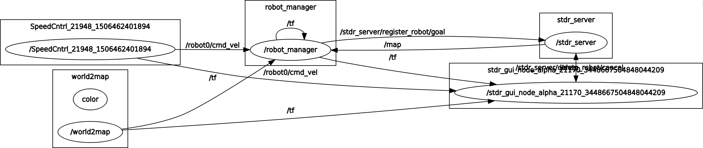

STDR - Simple Two Dimensional Robot Simulator
=============================================

.. Note:: Update for new text.  Keep as ROS 1 material.

Earlier you installed and tested the STDR simulator. Now we will use it
to simulate a robot moving around in plane. The same ROS
publish-subscribe interface is used here. As before, you write a control
program that publishes motion commands to the STDR Simulator that you
loaded earlier. The simulator currently implements a “magic round robot”
that can move freely in any direction. This is not like your automobile
which can only move forward (and turn in a specific manner).  [1]_ The
robot can be driven by using the examples in chapter one with the joy
and keyboard teleop nodes when the STDR simulator was initially
downloaded and built. There are other ways the robot can be driven
around which we demonstrate in this section; using either a multiarray
message or the twist message that contains kinematic parameters.

.. _`fig:stdr_sim`:
.. figure:: SimToolsFigures/stdr_gui.png
   :width: 70%
   :align: center

   STDR Simulator.

The simulator takes velocity commands in the :math:`x` and :math:`y`
directions and moves the robot with those velocities. This allows for
any sort of robot to be simulated by having an external node handle the
specific robot’s kinematics. So then the sim does not need to preprogram
all the different popular styles of robots. The sim subscribes to a
Twist message (discussed below in the messages section) containing the
robot velocities. It will perform the time steps (integrations) to move
the robot. It is important that the user provides accurate velocity
commands based on the wheels and vehicle design.

.. _`fig:stdr_basic`:
.. figure:: SimToolsFigures/stdr_basic.*
   :width: 70%
   :align: center

   STDR Communications

To get you up and running, we have provided a differential drive robot
node which will convert wheel commands to correct robot velocities based
on the differential drive kinematics. First, we show you how to run the
simulator. Following that we demonstrate how to move the wheels (to move
the robot).

Running STDR
~~~~~~~~~~~~

In order to run the STDR simulator the user will need to run roslaunch
in order for it to be started with both the map and robot. For example,
to start the simulator with the robot and a map containing no obstacles
one would run the following inside of a terminal:

::

    roslaunch stdr_launchers no_obst_sim.launch

The roslaunch command does use tab completion so other launch files are
also accessible that will start up the simulator and all required nodes
to start simulation of the robot. There are other launch files that
include different maps and robots. These launch files will be named so
that the user can easily tell which map and kinematic model that the
robot will be using.

For example:

::

    roslaunch stdr_launchers omni_wheeled_no_obst_sim.launch
    roslaunch stdr_launchers diff_drive_no_obst_sim.launch

Once roslaunch executes the user will be greeted by an application
looking similar to the one in :numref:`fig:stdr_sim`.
Roslaunch also starts up the ros master if there isn’t one already
running on the machine. It also starts up all the nodes and they can be
viewed in :numref:`fig:stdr_node_graph`.
This graph shows the ROS nodes running for just the STDR simulator with
the DDFK node and not any control code you may wish to run. So the
actual node complexity is a bit more than what
:numref:`fig:stdr_basic` implies since the STDR
node is really a placeholder for the graph shown in
:numref:`fig:stdr_node_graph`.

.. _`fig:stdr_node_graph`:

   Nodes running after STDR Simulator launch but before you launch your
   control code.

The message topics also get started and can be viewed by doing a
rostopic list. It is an extensive list and provides a look under the
hood for the simulator. While getting started you will not need to
interact with these topics, but later when we are working with sensors,
you will need to subscribe to some of the sensor topics.

::

    /map
    /map_metadata
    /robot0/cmd_vel
    /robot0/dt
    /robot0/laser_0
    /robot0/odom
    /robot0/pose2D
    /robot0/sonar_0
    /robot0/sonar_1
    /robot0/sonar_2
    /robot0/sonar_3
    /robot0/sonar_4
    /rosout
    /rosout_agg
    /stdr_server/active_robots
    /stdr_server/co2_sources_list
    /stdr_server/delete_robot/cancel
    /stdr_server/delete_robot/feedback
    /stdr_server/delete_robot/goal

::

    /stdr_server/delete_robot/result
    /stdr_server/delete_robot/status
    /stdr_server/register_robot/cancel
    /stdr_server/register_robot/feedback
    /stdr_server/register_robot/goal
    /stdr_server/register_robot/result
    /stdr_server/register_robot/status
    /stdr_server/rfid_list
    /stdr_server/sound_sources_list
    /stdr_server/sources_visualization_markers
    /stdr_server/spawn_robot/cancel
    /stdr_server/spawn_robot/feedback
    /stdr_server/spawn_robot/goal
    /stdr_server/spawn_robot/result
    /stdr_server/spawn_robot/status
    /stdr_server/thermal_sources_list
    /tf
    /tf_static

Driving the Robot - ROS STDR Messages
~~~~~~~~~~~~~~~~~~~~~~~~~~~~~~~~~~~~~

Once the simulator is up and running, you can drive the robot as before
using the teleop or joystick controls. As mentioned above, we can write
our own node to control the robot. This node needs to publish to either
the differential drive forward kinematics or directly to the simulator.
For simulating a differential drive, you will need to write a wheel
control node such as the example below which publishes left and right
wheel velocities. That node then coverts those to robot velocities and
sends the information to the STDR simulator. For your own custom robot,
you will need to write a forward kinematics node which connects to the
simulator. You would then send wheel velocities to your custom FK node.

MultiArray
^^^^^^^^^^

In order to drive the robot around in the simulator for a differential
drive robot, the wheel velocities, wheel radius, and the axle length are
needed to be published on the ``/kinematic_param`` topic as an tuple
containing four values.

The Python MultiArray is implemented as a tuple. A tuple is similar to a
list but not mutable like lists. They are distinguished from lists by
the use of parenthesis instead of brackets.

::

    >>> # tuple
    ...
    >>> a = (1,2,3)
    >>> a[0]
    1
    >>> a[1]
    2
    >>> a[1] = 4
    Traceback (most recent call last):
      File "<stdin>", line 1, in <module>
    TypeError: 'tuple' object does not support item assignment
    >>>

::

    import rospy
    from math import *
    import numpy as np
    from std_msgs.msg import Float64MultiArray
    from std_msgs.msg import MultiArrayLayout
    from std_msgs.msg import MultiArrayDimension
    r = 2.0
    l = 3.0
    def talker(w1, w2, r, l):
        pub = rospy.Publisher('kinematic_params', Float64MultiArray, queue_size=1)
        rospy.init_node('talker', anonymous=True)
        rate = rospy.Rate(10) # 10hz
        layout = MultiArrayLayout()
        layout.dim.insert(0, [MultiArrayDimension()] )
        while not rospy.is_shutdown():
            data = Float64MultiArray(data=[])
            data.layout = MultiArrayLayout()
            data.layout.dim = [MultiArrayDimension()]
            data.layout.dim[0].label = "Parameters"
            data.layout.dim[0].size = 4
            data.layout.dim[0].stride = 1
            data.data = [w1,w2,r,l]
            pub.publish(data)
            rate.sleep()

    if __name__ == '__main__':
            try:
                talker(1.5,1.0,r,l)
            except rospy.ROSInterruptException:
                pass

Similarly for a omni wheel robot the four wheel velocities would be
published followed by the wheel radius, front axle length, and lastly
the back axle length.

Twist Message
^^^^^^^^^^^^^

Communication with the simulator is through a ROS topic using the Twist
message type. The twist message is a compact array format that can be
more efficient than the string format used in the Two Link Manipulator.
The Twist format is

::

    # This expresses velocity in free space broken into its  linear and angular parts.
    Vector3  linear
    Vector3  angular

The twist message is contained in the geometry package:

::

    from geometry_msgs.msg import Twist

To set twist values on the publishing side, you can set the

::

    mytwist = Twist()
    mytwist.linear.x = x_vel
    mytwist.linear.y = y_vel
    mytwist.linear.z = z_vel

::

    mytwist.angular.x = x_ang_vel
    mytwist.angular.y = y_ang_vel
    mytwist.angular.z = z_ang_vel
    pub.publish(mytwist)

For the subscriber, you can access the data via:

::

    def callback(msg):
        rospy.loginfo("Received a /cmd_vel message!")
        rospy.loginfo("Linear Components: [%f, %f, %f]"%(msg.linear.x, msg.linear.y, msg.linear.z))
        rospy.loginfo("Angular Components: [%f, %f, %f]"%(msg.angular.x, msg.angular.y, msg.angular.z))

.. [1]
   Although this may seem completely made up, we will see in later
   chapters that there are robots that have this type of motion.
