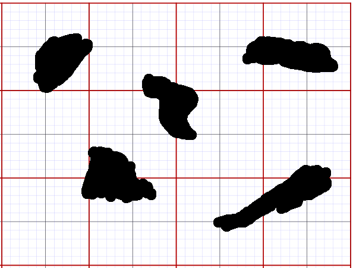
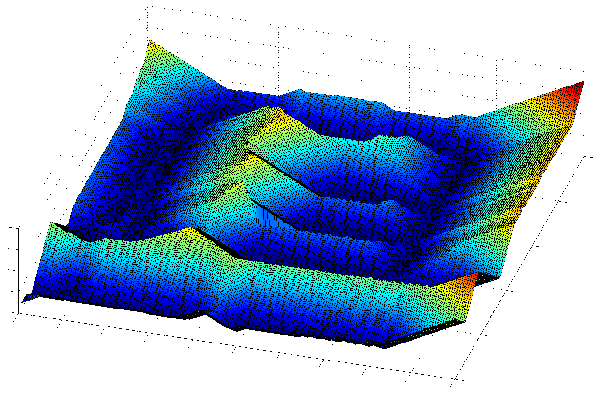

Brushfire Algorithm
-------------------

The :index:`Brushfire algorithm` is used to compute the distances which are used
in the repulsive potential. *It is not a planner!.* It will replace the
:math:`d(p,q)` function above and can be part of other planning
algorithms. Assume that your map is represented on a grid domain.

   A grid domain with obstacles. Normal practice is to label the cell as
   occupied if any part of the physical obstacle overlaps the cell.

.. figure:: PlanningFigures/brushfire.*
   :width: 35%
   :align: center

   Example of obstacle overlab with grid domain.

.. figure:: PlanningFigures/neighbors2.*
   :width: 35%
   :align: center

   Four and eight point connectivity to determine neighbors.

Four point neighbors have a distance which is the same as the Euclidean
distance. Eight point connectivity includes diagonals, greater
connectivity, but ignores diagonal distance.

-  Set free space pixels to zero.

-  Set pixels which are occupied, even partially, by objects to 1

-  Neighbor pixels (containing 0) to object pixels are set to 2

-  Neighbors (containing 0) to pixels containing 2 set to 3, etc

Gradient map made by looking at the smallest value in your connectivity.

.. _`fig:brushfire0`:
.. figure:: PlanningFigures/brushfire0.*
   :width: 95%
   :align: center

   Brushfire example

A gradient map can be produced at each pixel by finding the neighbor
pixel with the largest value. Both distance and gradient are now
available and thus a planning algorithm can use this to determine a
path. :numref:`fig:SteepestDescentPath`
shows the Steepest Descent Path. This path may not be unique due to the
discrete nature of the domain map. At each step, there can be multiple
cells with the same value. One must have a selection process and
different selection choices lead to different descent paths. Note that
this process will generalize to any dimension.

.. _`fig:SteepestDescentPath`:
.. figure:: PlanningFigures/brushfire_path.*
   :width: 50%
   :align: center

   Steepest Descent Path

Potentials and Brushfire
~~~~~~~~~~~~~~~~~~~~~~~~

The Brushfire algorithm may be used to replace the repulsive potential.
The attractive potential is still required to complete the routing. One
may use any form of attractive potential. The idea is to use the
atttractive potential to direct the robot to the goal. The Brushfire
algorithm can be used to keep the robot from colliding with an obstacle.
Since the Brushfire map includes distance to an obstacle, then the cells
of greatest increase are in the direction away from the obstacle. This
is a discrete negative gradient. In combination with the attractive
potential can be used to route.

   Brushfire Surface

One approach to planning is given in Algorithm `alg:brushfire`_. Assume that the domain is
discretized and the current location of the robot is indexed by
:math:`q = (i,j)`. Also assume the goal location is
:math:`q_{\text{goal}} = (i^*,j^*)`. Call the Brushfire cell number for
cell :math:`q = (i,j)`, :math:`b(q)`. The attractive potential in grid
coordinates is :math:`U = [(i-i^*)^2 + (j-j^*)^2]/2`, so the gradient
:math:`\nabla U =  (i-i^*,j-j^*) = q - q_{\text{goal}}`. We can combine
Brushfire with the discrete potential function to obtain the
Algorithm `alg:brushfire`_.

.. _`alg:brushfire`:
.. topic::  Discrete potential function planner

   | **Input** A point robot with a tactile sensor and :math:`D_\text{min}`.
   | **Output** A path to the goal.
   | **while** true **do**
   |   **repeat**
   |     Compute :math:`q_{\text{goal}}-q = (h,k)`.
   |     Compute :math:`z = \text{max}(h,k)` and :math:`\Delta q =  (\text{int } h/z, \text{int } k/z)`
   |     Compute :math:`q_{\text{new}} = q + \Delta q`
   |     Set :math:`q_{\text{new}} \to q`
   |   **until** :math:`q = q_{\text{goal}}` or :math:`b(q) = D_\text{min}`
   | **if** Goal is reached
   | **then** exit
   | Set :math:`L` equal to list of unvisited neighbor cells with :math:`b(i,j) = D_\text{min}`
   | **if** L is empty, **then** conclude there is no path to goal.
   | **repeat**
   |   Select :math:`q = (i,j) \in L`
   |   Compute :math:`q_{\text{goal}}-q = (h,k)`.
   |   Compute :math:`z = \text{max}(h,k)` and :math:`\Delta q =  (\text{int } h/z, \text{int } k/z)`
   |   Compute :math:`q_{\text{new}} = q + \Delta q`
   |   Set :math:`L` equal to list of unvisited neighbor cells with :math:`b(i,j) = D_\text{min}`
   |   **if** L is empty, **then** conclude there is no path to goal.
   | **until** :math:`q_{\text{goal}}` is reached or :math:`b(q_{\text{new}}) > D_\text{min}`

Dealing with discrete functions
~~~~~~~~~~~~~~~~~~~~~~~~~~~~~~~

How do we modify the potential function approach? Recall that we have

.. math:: U(q) = U_\text{att}(q) + U_\text{rep}(q)

with the attractive potential as

.. math::

   U_\text{att}(q) = \left\{ \begin{array}{ll} (1/2)\gamma d^2(q, q_\text{goal}), & d(q, q_\text{goal})\leq d^*_\text{goal},\\[3mm]
   d^*_\text{goal}\gamma d(q, q_\text{goal}) - (1/2)\gamma (d^*_\text{goal})^2, & d(q, q_\text{goal})> d^*_\text{goal},
   \end{array}\right.

and the repulsive potential as

.. math::

   U_\text{rep}(q) = \left\{ \begin{array}{ll} (1/2)\eta \left( \frac{1}{\tilde{D}(q)} - \frac{1}{Q^*}\right) , &
   \tilde{D}(q) \leq Q^*,\\[3mm]
   0, & \tilde{D}(q) > Q^*
   \end{array}\right.

where :math:`\tilde{D}` is found from the Brushfire Map. The issue is
that :math:`\tilde{D}` is not a continuous function. It is a piecewise
constant function and so :math:`\nabla \tilde{D}` is zero on all of the
interiors of the cells. [#f4]_

.. figure:: PlanningFigures/piecewise_const.*
   :width: 40%
   :align: center

The gradient can be estimated as the difference in cell values. Thus

.. math:: \nabla U_{rep}  = \left< \Delta \tilde{D} / \Delta x , \Delta  \tilde{D} / \Delta y \right>

Because the discrete distance function jumps, it can cause the path to
oscillate back and forth along the normal direction to the
obstacle. [#f5]_ Tuning the potential function can also be challenging.
One may need to adjust weights in the sum:

.. math:: aU_\text{att}(q) + bU_\text{rep}(q)

What one wants is motion orthogonal to the boundary of the obstacle.

Motion towards the obstacle is in the direction of the repulsive
potential gradient, :math:`\nabla U_\text{rep}`, so we select motion
orthogonal to the gradient, :math:`\nabla U_\text{rep}^{\perp}`:

.. math:: \mbox{Heading} = \lambda (1-d) \nabla U_\text{att} + \lambda d \nabla U_\text{rep}^{\perp}

where :math:`d = D/Q^*` and :math:`\lambda` is positive “tunable"
value. This gives a smooth transition to orthogonal motion. We still
need to understand :math:`\nabla U_\text{rep}^{\perp}`.

The orthogonal subspace :math:`\nabla U_\text{rep}^{\perp}` is a line.
From this we need to select a direction. We can do this by projecting
the gradient of the attractive potential onto the subspace:

.. math::

   \mbox{proj}(\nabla U_\text{att})_{\nabla U_\text{rep}^{\perp}} =
   \displaystyle \frac{\left(\frac{\partial U_\text{att}}{\partial x}\right)\left(\frac{\partial U_\text{rep}}{\partial y}\right)- \left(\frac{\partial U_\text{att}}{\partial y}\right)\left(\frac{\partial U_\text{rep}}{\partial x}\right) }
   { \| \nabla U_\text{rep}\|^2} \nabla U_\text{att} .

Local Minima Problem
~~~~~~~~~~~~~~~~~~~~

Gradient descent will move towards a local minimum, but not necessarily
the global minimum. Take the map with goal given by
:numref:`potentialwell`.

.. _`potentialwell`:
.. figure:: PlanningFigures/well.*
   :width: 50%
   :align: center

   Using an attractive potential function centered at the goal and a
   repulsive potential function based on distance from the obstacle, the
   robot will be attracted to some point *x* where it will stop. This
   point is a local minimum in the combined potential function
   (attractive and repulsive potentials combined).

There is a point, *x* inside the horseshoe where the attractive forces
and repulsive forces balance giving rise to a local min for the combined
potential function. The robot will stall at this point. There is not a
simple fix here.

Maximum obstacle distance path
~~~~~~~~~~~~~~~~~~~~~~~~~~~~~~

Some routing problems require the vehicle to keep a maximum distance
from obstacles. For example, quadrotors are effected by ground and wall
effects which can cause collisions and vehicle damage. Using the
Brushfire and Wavefront algorithms together can be used to produce safe
paths. The idea is to use the Brushfire algorithm to do the
skeletalization of the domain. Then the Wavefromt algorithm searches the
reduced path.

-  Use Brushfire to find equidistance points or ridges and label ridge
   pixels

-  Compute shortest path between start point and the ridge: start path

   -  Use a Wavefront planner.

   -  Set the start point as the wave start.

   -  Stop when the wave hits the ridge.

   -  Label start path pixels

-  Compute shortest path between end point and the ridge: end path

   -  Use a Wavefront planner.

   -  Set the end point as the wave start.

   -  Stop when the wave hits the ridge.

   -  Label end path pixels.

-  Back track along different segments in the path list to find global
   path

   -  Starting at end pixel.

   -  Apply wavefront to labeled pixels.

   -  Stop wavefront when start pixel is found.

.. rubric:: Footnotes

.. [#f4] Known as zero "almost everywhere".

.. [#f5] This is due to the switching on and off a large repulsive potential.
