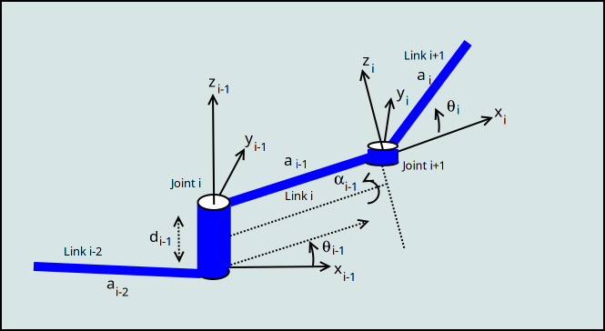
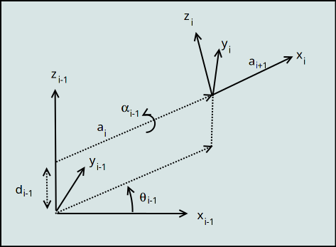
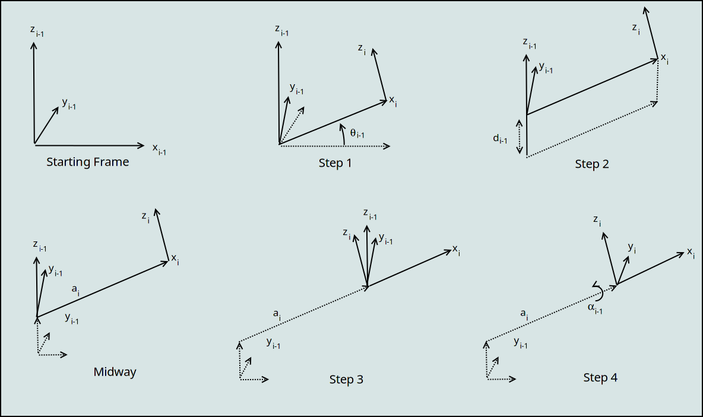

:index:`Denavit-Hartenberg Convention`
----------------------------------------

In a number of science fiction movies you will see (CGI) versions of
serial chain manipulators that have a large number of links.  These
manipulator twist around in space and do some amazing things.
We also know that movie evil geniuses
are smart - hence the name evil genius.  However, we know that most
are rather impatient.  How, you wonder did they stick with all of the
algebra to compute forward and inverse kinematics.  The answer is
that they also had a "tabular" or automated approach to the problem.
This is what we introduce in this section - a convention for systematically
computing the forward kinematics.

Given joint angles and actuator lengths one can compute the
end effector position. Thus it is possible to compute the effector path as a
function of arm movements.

.. math::

   \begin{pmatrix} \theta_1(t), ... , \theta_n(t)
              \end{pmatrix}\to p(t)

A simple way to relate the end effector to the base for a serial chain
manipulator is to see each link as a transformation of the base coordinate
system.  This is the approach suggested by Denavit and Hartenberg.

:index:`Denavit-Hartenberg Parameters`
~~~~~~~~~~~~~~~~~~~~~~~~~~~~~~~~~~~~~~~

The DH convention provides a standard way to build kinematic models for a robot.
It is a simple concept and the complexity is hidden in the composition
of linear transformations.  This provides a powerful way to generate
the kinematic equations in a consistent form.
As suggested above, we follow out the links of the manipulator,
and see them as rotations and
translations of the coordinate system:

  .. math:: A = A_0 A_1 ...A_{n-1} A_n

where :math:`A_k = R_z T_z T_x R_x`

.. figure:: TermsFigures/DH_single.*
   :align: center
   :width: 25%

Each link is assigned a number. Normally start with the base and work towards the effector.
All joints are represented by the z axis, where the z  axis is the axis of revolution or the direction of motion if prismatic.  The base frame will be indicated by :math:`x_0, y_0, z_0`.  The joint numbering and the link numbering will be the same.  The frame will have an index of one less.

Assume you want to extend from joint i to joint i+1.  To build the new frame at the new joint
we do the following:

-  The axis :math:`z_i` is defined by the axis of the joint rotation.

-  The origin of the frame for joint i+1 is :math:`O_i`.  Find the common normal between :math:`z_i` and  :math:`z_{i-1}`.   This is the line segment perpendicular to both z axes and is of minimal distance.

-  The intersection of the common normal defines the new origin for joint i+1's frame: :math:`O_i`.

-  Define :math:`x_i` (joint i+1) in the direction of the common normal pointing from joint i to i+1.

-  Define :math:`y_i` so that :math:`x_, y_i, z_i` are a right handed frame.

We have the following parameters:

-  :math:`\theta_i` will represent the rotation about the joint.

-  :math:`a_i` is the common normal length (commonly the link length).

-  :math:`\alpha_i` will be the angles between z axes about the common normal (if they are not
   parallel, if so, :math:`d` is a free parameter.).

-  :math:`d_i` will represent the offset along the z axis.

Thus, the transformation from one joint to the next involves a rotation,
translation, translation and a rotation:

-  Rotate about the local z axis angle :math:`\theta`.

-  Translate (offset) along the z axis amount :math:`d`.

-  Translate (link length) along x (common normal) amount :math:`a`.

-  Rotate about the x (common normal) axis (the joint twist) amount :math:`\alpha`.

This set of transformations will then change the coordinate system to
the next link in the serial chain.

:math:`A_{n} =`

.. math::

   \begin{pmatrix}\cos \theta_{n} & -\sin \theta_{n} & 0 & 0 \\
            \sin \theta_{n} & \cos \theta_{n} & 0 & 0\\ 0 &0 & 1 & 0 \\
            0& 0& 0& 1 \end{pmatrix}
            \begin{pmatrix}1 & 0 & 0 & 0 \\ 0 & 1 & 0 & 0  \\
            0& 0 & 1 & d_{n} \\
            0& 0& 0& 1 \end{pmatrix}
            \begin{pmatrix}1 & 0 & 0 & a_{n} \\ 0 & 1 & 0 & 0  \\
            0& 0 & 1 & 0 \\
            0& 0& 0& 1 \end{pmatrix}

.. math::

   \times
    \begin{pmatrix}1 & 0 & 0 & 0 \\ 0 & \cos \alpha_{n} & -\sin \alpha_{n} & 0  \\
            0& \sin \alpha_{n} & \cos \alpha_{n} & 0 \\
            0& 0& 0& 1 \end{pmatrix}

:math:`A_{n} =`

.. math::

  \begin{pmatrix}\cos \theta_{n} & -\sin \theta_{n}\cos \alpha_{n} & \sin \theta_{n}\sin \alpha_{n} & a_{n}\cos \theta_{n} \\
  \sin \theta_{n} & \cos \theta_{n}\cos \alpha_{n} & -\cos \theta_{n}\sin \alpha_{n}  & a_{n}\sin \theta_{n} \\ 0 & \sin \alpha_{n}& \cos \alpha_{n} & d_{n} \\
  0& 0& 0& 1 \end{pmatrix}

A parameter table keeps track for each link, the values of :math:`\theta`, :math:`d`, :math:`a` and :math:`\alpha`.

Starting from the base of the robot, we can built the transformation
that defines the kinematics:

.. math:: A = A_1A_2 \dots A_n = \prod_{i=1}^n A_i

Before we proceed with the examples, it is useful to summarize what has been done.  Using the
DH notation, we can construct the transformation at each joint.  Taking the product of those transformations
gives us the relationship of the end-effector (tool tip) to the base coordinate system or frame.  The transformation is

.. math::

   A =
   \begin{pmatrix} a_{11}(q) & a_{12}(q) & a_{13}(q) & p_1(q) \\
   a_{21}(q) & a_{22}(q) & a_{23}(q) & p_2(q) \\
   a_{31}(q) & a_{32}(q) & a_{33}(q) & p_3(q) \\
   0 & 0 & 0 & 1 \end{pmatrix} =
   \begin{pmatrix} \vec{n} & \vec{o} & \vec{a} & \vec{p} \\ 0 & 0 & 0 & 1 \end{pmatrix}

The position of the end-effector can be extracted as :math:`\vec{p} = <p_1, p_2, p_3>` and the direction of the tip is given
by :math:`\vec{a}=<a_1,a_2,a_3>`.    This is not the orientation vector and we need to be careful here with orientation.
What we mean is this is not the orientation  as a vector of Euler angles.
Euler angles provide the rotations about the axes (x, y, z) which would relate tool tip to
the x-axis in the base frame.  The Euler angles orientation vector, :math:`\phi` can be difficult to find in general
and often one does not have an analytic representation.  The value :math:`\phi` is needed if one wanted to
computer the angular velocity of the tool tip.

D-H Two Link Example
~~~~~~~~~~~~~~~~~~~~~

+------+------------------+-----------+-------------+----------------+
| Link | :math:`\theta`   | :math:`d` | :math:`a`   | :math:`\alpha` |
+======+==================+===========+=============+================+
| 1    | :math:`\theta_1` | 0         | :math:`a_1` | 0              |
+------+------------------+-----------+-------------+----------------+
| 2    | :math:`\theta_2` | 0         | :math:`a_2` | 0              |
+------+------------------+-----------+-------------+----------------+

.. math::

   A_1 =\begin{pmatrix}\cos \theta_1 & -\sin \theta_1 & 0 & a_1 \cos \theta_1 \\
            \sin \theta_1 & \cos \theta_1 & 0 & a_1 \sin \theta_1
           \\ 0 &0 & 1 & 0 \\
            0& 0& 0& 1 \end{pmatrix}

.. math::

   A_2 =\begin{pmatrix}\cos \theta_2 & -\sin \theta_2 & 0 & a_2 \cos \theta_2 \\
            \sin \theta_2 & \cos \theta_2 & 0 & a_2 \sin \theta_2 \\ 0 &0 & 1 & 0 \\
            0& 0& 0& 1 \end{pmatrix}

So,

.. math::

   A = A_1A_2 =
     \begin{pmatrix}\cos (\theta_1+\theta_2) & -\sin (\theta_1+\theta_2) & 0 & a_2 \cos (\theta_1+\theta_2) + a_1 \cos \theta_1 \\
   \sin (\theta_1 +\theta_2) & \cos (\theta_1 +\theta_2) & 0 & a_2 \sin (\theta_1 +\theta_2) + a_1\sin \theta_1\\
            0 &0 & 1 & 0 \\
            0& 0& 0& 1
     \end{pmatrix}

Then the location of the end effector :math:`(x,y,z) = (p_x, p_y, p_z)`:

.. math::

   \begin{pmatrix}
   x \\ y \\ z
   \end{pmatrix}
   =
   \begin{pmatrix}
   a_2\cos (\theta_1+\theta_2) + a_1 \cos \theta_1 \\
   a_2 \sin (\theta_1 +\theta_2) + a_1\sin \theta_1 \\
   0
   \end{pmatrix}

And it agrees with the earlier form.  [1]_  As a planar function, we are not worried about orientation around x or y.
The :math:`\theta_i` are all rotating around a common direction, :math:`z` .  This implies that
the orientation about z is :math:`\phi = \theta_1 + \theta_2`.

DH Inverse Kinematics
~~~~~~~~~~~~~~~~~~~~~~~~~~~~

It is much more difficult to find the inverse (parameters) functions if you are given the end
effector path:

.. math::

   p(t) \to \begin{pmatrix} \theta_1(t), ... , \theta_n(t)
              \end{pmatrix}

How can we use this technology to assist with the inverse kinematics problem?

.. math::

   T^{-1}
     = T_0^{-1} T_{1}^{-1} \dots T_{n-1}^{-1} T_n^{-1}

In each matrix one can solve algebraically for :math:`\theta_i` in terms
of the orientation and displacement vectors. What does this look like
for the two link manipulator?

Then we have that the transformation carries the frame to some frame
description :math:`A = F`:

.. math::

   A = \begin{pmatrix}\cos (\theta_1+\theta_2) & -\sin (\theta_1+\theta_2) & 0 & a_2 \cos (\theta_1+\theta_2) + a_1 \cos \theta_1 \\
   \sin (\theta_1 +\theta_2) & \cos (\theta_1 +\theta_2) & 0 & a_2 \sin (\theta_1 +\theta_2) + a_1\sin \theta_1\\
            0 &0 & 1 & 0 \\
            0& 0& 0& 1
     \end{pmatrix}

.. math::

   =
     \begin{pmatrix}
            n_x & o_x & a_x & p_x \\
            n_y & o_y & a_y & p_y\\
            n_z & o_z & a_z & p_z \\
            0  &  0  &  0 & 1 \end{pmatrix} = F

Reversing the sequence
of matrices does not give the inverse kinematics.   Going forward along the product of the matrices traces a
path along the robotic arm from the base to the tip given the joint angles.  Reversing the process takes us from the tip to
the base given that set of joint angles.  What we want is a function that give the tip location, we determine the various rotation angles.   However, this reverse stacking of the transformation matrices can help one in the algebraic
process of working out the inverse functions.  In other words, it provides a structure to do the function
inverse.  Recall the reverse ordering:

.. math::

   T^{-1}
     = T_0^{-1} T_{1}^{-1} \dots T_{n-1}^{-1} T_n^{-1}

In each matrix one can solve algebraically for :math:`\theta_i` in terms
of the orientation and displacement vectors. What does this look like
for the two link manipulator?

Recall that

.. math::

   A_1 =\begin{pmatrix}\cos \theta_1 & -\sin \theta_1 & 0 & a_1 \cos \theta_1 \\
            \sin \theta_1 & \cos \theta_1 & 0 & a_1 \sin \theta_1
           \\ 0 &0 & 1 & 0 \\
            0& 0& 0& 1 \end{pmatrix}

.. math::

   A_2 =\begin{pmatrix}\cos \theta_2 & -\sin \theta_2 & 0 & a_2 \cos \theta_2 \\
            \sin \theta_2 & \cos \theta_2 & 0 & a_2 \sin \theta_2 \\ 0 &0 & 1 & 0 \\
            0& 0& 0& 1 \end{pmatrix}

Thus

.. math::

   A = A_1(\theta_1)A_2(\theta_2) = \begin{pmatrix}
            n_x & o_x & a_x & p_x \\
            n_y & o_y & a_y & p_y\\
            n_z & o_z & a_z & p_z \\ 0 & 0 & 0 & 1\end{pmatrix}

Right multiply to decouple: :math:`A_1 = A A_2^{-1}`

.. math::

   =\begin{pmatrix}\cos \theta_1 & -\sin \theta_1 & 0 & a_1 \cos \theta_1 \\
            \sin \theta_1 & \cos \theta_1 & 0 & a_1 \sin \theta_1
           \\ 0 &0 & 1 & 0 \\
            0& 0& 0& 1 \end{pmatrix}

.. math::

   = \begin{pmatrix}
            n_x & o_x & a_x & p_x \\
            n_y & o_y & a_y & p_y\\
            n_z & o_z & a_z & p_z \\ 0 & 0 & 0 & 1\end{pmatrix}
            \begin{pmatrix}\cos \theta_2 & -\sin \theta_2 & 0 & -a_2  \\
            \sin \theta_2 & \cos \theta_2 & 0 & 0 \\ 0 &0 & 1 & 0 \\
            0& 0& 0& 1 \end{pmatrix}

Note that :math:`a_1\cos\theta_1 = p_x - a_2n_x` and
:math:`a_1\sin\theta_1 = p_y - a_2n_y`

This provides us with

.. math:: \theta_1 = \mbox{atan2}\left(\frac{p_y - a_2n_y}{a_1} , \frac{p_x - a_2n_x}{a_1}\right)

| From :math:`\cos \theta_1 = \cos \theta_2 n_x - \sin \theta_2o_x` and
  :math:`-\sin \theta_1 = \sin \theta_2 n_x + \cos \theta_2o_x`
| we can solve for :math:`\theta_2`.

.. math::

   \begin{pmatrix} \cos \theta_1 \\ -\sin \theta_1 \end{pmatrix}
     = \begin{pmatrix}n_x & -o_x  \\ n_x & o_x \end{pmatrix}
     \begin{pmatrix} \cos \theta_2 \\ \sin \theta_2 \end{pmatrix}

.. math::

   \begin{pmatrix} \cos \theta_2 \\ \sin \theta_2 \end{pmatrix}
     = \frac{1}{2n_xo_x}\begin{pmatrix}o_x & o_x  \\ -n_x & n_x \end{pmatrix}
     \begin{pmatrix} \cos \theta_1 \\ -\sin \theta_1 \end{pmatrix}

So ...
:math:`\theta_2 = \mbox{atan2} \left( o_x(\cos \theta_1 -\sin \theta_1 ), -n_x(\cos \theta_1 +\sin \theta_1 )\right)`

There is a problem. The two link example has two degrees of freedom. The
assumption here is that you have four variables to input (four degrees
of freedom): :math:`p_x, p_y, n_x, n_y`. You may not know
:math:`n_x, n_y`. [2]_ For general systems this approach will succeed if
you have enough degrees of freedom in your robot.

:index:`Three link manipulator`
~~~~~~~~~~~~~~~~~~~~~~~~~~~~~~~~~

A simple extension of the two link is the three link planar manipulator.   It
has DH parameters as

+------+------------------+-----------+-------------+----------------+
| Link | :math:`\theta`   | :math:`d` | :math:`a`   | :math:`\alpha` |
+======+==================+===========+=============+================+
| 1    | :math:`\theta_1` | 0         | :math:`a_1` | 0              |
+------+------------------+-----------+-------------+----------------+
| 2    | :math:`\theta_2` | 0         | :math:`a_2` | 0              |
+------+------------------+-----------+-------------+----------------+
| 3    | :math:`\theta_3` | 0         | :math:`a_3` | 0              |
+------+------------------+-----------+-------------+----------------+

Products of the transformation matrices (and some trig) give us

.. math::

   \begin{pmatrix}c_{123} & -s_{123} & 0 & a_3 c_{123} + a_2 c_{12} + a_1 c_1 \\
      s_{123} & c_{123} & 0 & a_3 s_{123} + a_2 s_{12} + a_1s_1\\
            0 &0 & 1 & 0 \\
            0& 0& 0& 1
   \end{pmatrix}

where :math:`c_1 = \cos(\theta_1)`, :math:`c_{12} = \cos(\theta_1+\theta_2)`, :math:`c_{123} = \cos(\theta_1+\theta_2+\theta_3)`,  :math:`s_1 = \sin(\theta_1)`, :math:`s_{12} = \sin(\theta_1+\theta_2)`, :math:`s_{123} = \sin(\theta_1+\theta_2+\theta_3)`.

Extending the 2D result, the orientation (about z) :math:`\phi = \theta_1+\theta_2+\theta_3`.

The IK formulas for the three link manipulator can be extrapolated from the two link manipulator.   The workspace for this manipulator is two dimensional (x,y) and the configuration space is three dimensional :math:`(\theta_1, \theta_2, \theta_3 )`.  We don't expect an inverse function going from :math:`{\Bbb R}^2 \to {\Bbb R}^3`.  We expect on degree of freedom on the inverse and intuitively we should be able to select location and approach angle.  So we an select :math:`(x, y, \phi)` with some restrictions based on the workspace envelope.

The approach angle :math:`\phi = \theta_1 + \theta_2 + \theta_3`.   Using the approach angle :math:`\phi` and the link length, we can find the joint location of the joint 3:

.. math::

   W = (w_x, w_y) = (x - a_3\cos\phi , y - a_3\sin\phi)

Backing up to :math:`W` means we can employ the two link formulas.

.. math::

   c_2 = \frac{w_x^2 + w_y^2 - a_1^2 - a_2^2}{2a_1a_2} , \quad s_2  = \pm \sqrt{1 - c_2^2}, \quad
   \theta_2 = \mbox{atan2}(s_2,c_2)

.. math::

   s_1 = \frac{(a_1+a_2)w_y - a_2s_2w_x}{w_x^2+w_y^2}, \quad c_1 = \frac{(a_1+a_2)w_x + a_2s_2w_y}{w_x^2+w_y^2}, \quad
   \theta_1 = \mbox{atan2}(s_1, c_1), \quad \theta_3 = \phi - \theta_1 - \theta_2

This gives one degree of freedom parameterized by :math:`\phi` [if you see this as a function of (x,y)].

.. _numerica-inverse-kinematics-1:

Inverse kinematics numerical approaches
~~~~~~~~~~~~~~~~~~~~~~~~~~~~~~~~~~~~~~~~

A number of robotics engineers will tell you that you want to design your robot with inverse kinematics in mind.  This means keeping the design simple when possible, having ways to partition the system so that components can be controlled separately and leverage existing design when it makes sense.    If you do need to know joint values as a function of position, this can be approximated numerically.    The FK equations can be intimidating, but they are nonlinear algebraic equations.  There are approaches to solving systems of nonlinear equations.  The tools fall in gradient based and gradient free approaches.   The gradient methods, as the name implies, require derivatives to be supplied to the solver.  Gradient free methods do not.  We will look at numerical methods in the simulation chapter and leave off here with the comment that in many cases we can find good numerical inverses even when we cannnot do so analytically.

.. [1]
   Was there a great sigh of relief here?  ... That the kinematic formulas for position agree with the ones found earlier.

.. [2]
   We will explore this more in the next section.
