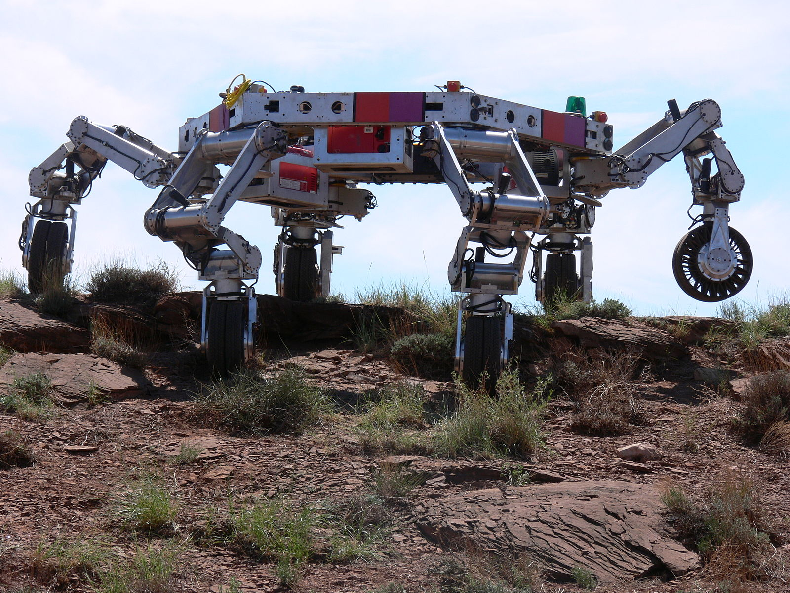
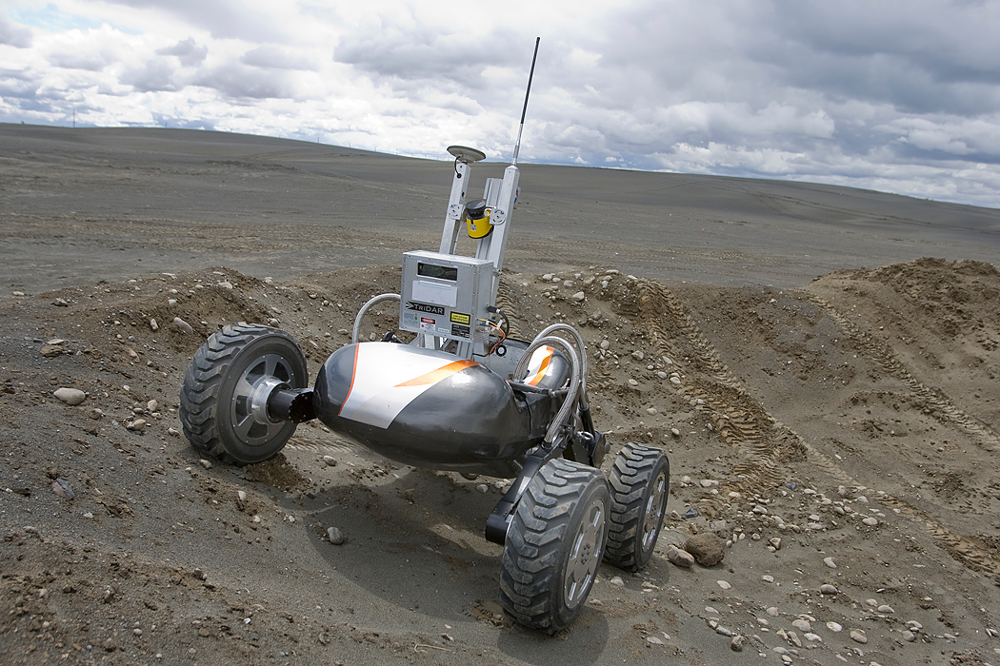
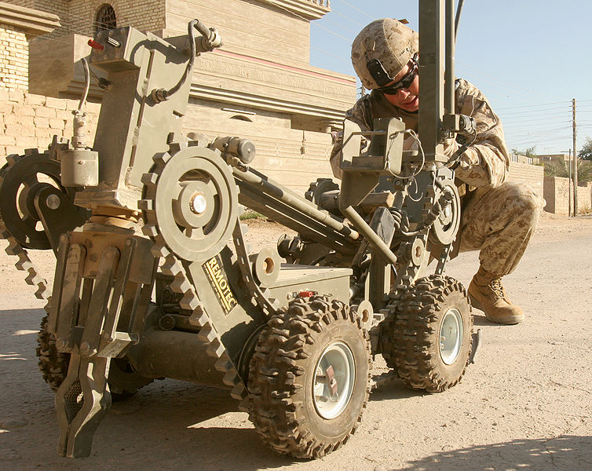

What exactly is a robot?
------------------------

.. This image is public domain
.. figure:: IntroductionFigures/Honda_ASIMO.jpg
   :scale:  50%

   The Honda Asimo Robot [Wikipedia]_

.. This image is public domain
.. figure:: IntroductionFigures/Foundry_robot.jpg
   :scale:  75%

   Kuka robot [Wikipedia]_

Definition
~~~~~~~~~~

What is a robot? This is actually a complicated question. Wikipedia
defines a robot in the following manner: *A robot is a mechanical
intelligent agent which can perform tasks on its own, or with guidance;
usually an electro-mechanical machine which is guided by computer and
electronic programming.* (There are plenty of opinions on Wikipedia. I
find that it is pretty good for math, science and engineering quick
reference but not always an expository presentation. It is also good at
reflecting opinions, which in this case is useful.) Merriam-Webster, on
the other hand, says a robot is *a real or imaginary machine that is
controlled by a computer and is often made to look like a human or
animal.* According to the Encyclopaedia Britannica, a robot is *any
automatically operated machine that replaces human effort, though it may
not resemble human beings in appearance or perform functions in a
humanlike manner*.

.. This image is public domain

   Repliee Q2 - developed by Osaka University and manufactured by
   Kokoro Company Ltd. [Repliee_Q2]_

.. This image is public domain

   The NASA ATHLETE rover as it climbs to the top of a hill. [Wikipedia]_

This latter definition includes washing machines, bread makers, and
other devices not generally seen as a robot. However, as we will argue,
that does not matter! A definition of robot that uses form or motion is
flawed. What if we made the statement broader? **A robot is seen as a
sophisticated machine that, as stated above, replaces human effort**.
Nothing else really defines robotics as well.

Regardless of definition, these machines surround us. Today we can see
them used in from manufacturing to exploration, from assistive
technologies and medicine to entertainment, from research to education,
and much more.

.. This image is public domain
.. figure:: IntroductionFigures/Roomba_Discovery.jpg
   :scale: 25%

   iRobot Roomba Discovery 2.1. [Wikipedia]_

.. This image is public domain

   NASA experimental drilling robot. [Wikipedia]_

There is no consensus on which machines qualify as robots. However,
there *is* a general agreement that robots exhibit behaviors which mimic
humans or animals - that is, *behavior which seems intelligent.* We
expect the robot to interact with its environment and the objects within
that environment. Most of us may expect that the robot performs this
interaction through movement and sensation.

.. This image is public domain
.. figure:: IntroductionFigures/KeeponTophatNextfest2007.jpg
   :scale: 50%

   Keepon - therapy robot.  [Wikipedia]_

.. This image is public domain

   Robot tasked to detonate a buried improvised explosive device. [Wikipedia]_

Many may expect the robot to perform complex tasks or deal with harsh,
unforgiving environments. Some may expect a robot to be an extension of
themselves through teleoperation or remote control, while others expect
it to be a fully autonomous device.

We can boil down our notion of robot abilities to three things:

**Perception:**
    sensing the environment and to a limited degree understanding the
    sensory information.

**Cognition:**
    ability to make decisions and responses based on the sensory
    information and not acting in a pre-programmed manner.

**Actuation:**
    full mobility of the machine or control of a tool through a
    manipulator.

.. This image is public domain
.. figure:: IntroductionFigures/Laproscopic_Surgery_Robot.jpg
   :scale: 50%

   Da Vinci Surgical System [DaVinci]_ .

.. This image is public domain
.. figure:: IntroductionFigures/PR2_Tabletop.jpg
   :scale: 20%

   Willow Garage's PR2 robot.

One interesting phenomenon that could be influencing the lack of a solid
definition for the term is that what we label a “robot" varies with
time. When a new capability arises, one that was previously considered
to be solely in the domain of humans and animals, we tend to label it a
robot. As soon as that capability becomes routine, the device is thought
of a mechatronic device.

.. This image is public domain
.. figure:: IntroductionFigures/Robonaut2.jpg
   :scale: 40%

   NASA's Robonaut.

.. This image is public domain
.. figure:: IntroductionFigures/RUNSWift_Naos_2010.jpg
   :scale: 20%

   RoboCup Standard Platform League (Image from 2010).

Robots embody technological magic. So, it is natural that some
previously unseen ability programmed into a machine will have a magic
quality for humans, thus making that machine more of a robot. But with
time, we get accustomed to it, and the magic gets replaced with
expectation.

.. This image is public domain
.. figure:: IntroductionFigures/Beam_telepresence_robot.jpg
   :scale:  30%

   An Intel IT Labs researcher working on a remote telepresence robot pilot
   project that uses Suitable Technologies' Beam robot.

.. This image is public domain
.. figure:: IntroductionFigures/ROV_working_on_a_subsea_structure.jpg
   :scale: 25%

   ROV working on a subsea structure.

.. This image is public domain
.. figure:: IntroductionFigures/Justus_robot_in_Krakow_Poland_Aug2009.jpg
   :scale: 50%

   Justus security robot in front of Krakow railway station [JustusSecurity]_ .

It can be argued that there is nothing new in the subject of robotics -
that all we are doing is building machines. Nothing different than what
engineers have been doing all along. The term robotics has more to do
with our ego and psychology than anything to do with science and
technology. However, there is a body of knowledge related to building
machines that interact in human or physical environments. This is what
we will consider robotics.

.. This image is public domain
.. figure:: IntroductionFigures/Rhex.jpg
   :scale: 40%

   Rhex: DARPA project on compliant six legged robots.

A brief history
~~~~~~~~~~~~~~~

1023 BC
'''''''

In ancient China, a curious account on automata is found in the Lie Zi
text, written in the 3rd century BC. Within it there is a description of
an encounter between King Mu of Zhou (1023-957 BC) and a mechanical
engineer known as Yan Shi, who was an ’artificer’. According to the
text, the artificer proudly presented the king with a life-size,
human-shaped figure of mechanical handiwork which could sing and move in
a life-like manner.

205 BC
''''''

In ancient Greece, an orrery known as the Antikythera Mechanism is
developed. This device is credited as being the first analog computer.

.. figure:: IntroductionFigures/antikytheramachine.jpg
   :scale: 50%

   Antikythera Mechanism [Antikythera]_ .

270 BC
''''''

The Greek engineer Ctesibius (c. 270 BC) applies a knowledge of
pneumatics and hydraulics to produce the first organ and water clocks
with moving figures.

1088 AD
'''''''

The Cosmic Engine, a 10-meter (33 ft) clock tower built by Su Song in
Kaifeng, China. It featured mechanical mannequins that chimed the hours,
ringing gongs or bells among other devices.[6][7]

1206 AD
'''''''

Al-Jazari (1136-1206), an Arab Muslim inventor during the Artuqid
dynasty, designed and constructed a number of automatic machines,
including kitchen appliances, musical automata powered by water, and the
first programmable humanoid robot in 1206. Al-Jazari’s robot was a boat
with four automatic musicians that floated on a lake to entertain guests
at royal drinking parties. His mechanism had a programmable drum machine
with pegs (cams) that bump into little levers that operate the
percussion. The drummer could be made to play different rhythms and
different drum patterns by moving the pegs to different locations.[8]

   Al-Jazari’s Mechanical Musical Boat.

1495
''''

Leonardo da Vinci draws plans for a mechanical knight.

1922
''''

The word *robot* is introduced to the English language through the play
Rossum’s Universal Robots by the Czech writer Karel Čapek. The play is
centered around a factory staffed by intelligent cyborgs. The English
term robot comes from the Slavic word *robota* which roughly translates
as work or labor. Credit for the term goes to Karel’s brother Josef.

1954
''''

Following World War II, efforts in automation increased. Early advances
were seen in teleoperation and computer numerically controlled (CNC)
machining. General Electric produced machines that had a master slave
approach where the master manipulator would control the slave. The CNC
machines gained popularity in the aircraft industry by milling high
performance parts in lower volumes. The merger of these two technologies
produced the first programmed articulated device by George Devol in
1954. He replaced the master manipulator with CNC technology. Joseph
Engelberger purchased the rights and founded Unimation in 1956.
Unimation placed its first robot arm in a General Motors plant in 1961.

1969
''''

The 1960’s saw significant experimentation with manipulator designs,
feedback systems and actuator types. One such example of a robotic
manipulator is the Stanford Hydrolic Arm and Stanford Manipulator,
designed in 1969 by Victor Scheinman, a Mechanical Engineering student
working in the Stanford Artificial Intelligence Lab (SAIL).

1973
''''

The Cincinnati Milacron :math:`T^3` is released. It was a heavy lift
assembly line manipulator. In 1978, Unimation introduced the PUMA,
(Programmable Universal Machine for Assembly) and JPL started a research
program to develop space based teleoperated manipulators. By the late
1970’s, applications for industrial robots grew quickly and robots in
industry became established.

The history for mobile robots is much more recent. The challenges for
mobile robots, as we will see later on, are fundamentally different than
industrial automation. An early example is the Johns Hopkins *Beast*. It
was a simple autonomous mobile system that navigated using touch sensors
and could recharge itself. This system required an instrumented
environment. A notable development is *Shakey*, by the Stanford Research
Institute (SRI) from 1966-72. This robot implemented computer vision and
natural language processing and is responsible for the development of
the A\* search algorithm, the Hough transform, and visibility graphs.

Robots in the news
~~~~~~~~~~~~~~~~~~

Items are hyperlinked to web pages.

**2017**

-  `Tertill (Franklin Robotics) - Fully autonomous weeding
   robot. <http://www.franklinrobotics.com/>`__

-  `Minitaur (Ghost Robotics) - Legged version of the Rhex but with
   enhanced obstacle response. <https://www.ghostrobotics.io/>`__

-  `Fast Foward. Autonomous delivery robot.
   Paggio. <http://piaggiofastforward.com/>`__

-  `Cobalt Indoor Security Robots. Collaboratory security
   robots. <https://www.cobaltrobotics.com/>`__

-  `Ekso GT, exoskeleton to assist paraplegics. Ekso
   Bionics <http://eksobionics.com/>`__

-  `Kuri. Home “social" robot. Mayfield
   Robotics. <http://www.mayfieldrobotics.com/>`__

**2016**

-  `SpotMini, a compact version of Boston Dynamics’ Spot
   robot. <http://spectrum.ieee.org/automaton/robotics/home-robots/boston-dynamics-spotmini/>`__

-  `Pleurobot - experiments in salamander motion through
   robotics. <http://spectrum.ieee.org/automaton/robotics/robotics-hardware/how-epfl-made-pleurobot/>`__

-  `Vyo - Different approach to social domestic
   robots. <http://spectrum.ieee.org/automaton/robotics/home-robots/vyo-robotic-smart-home-assistant/>`__

**2015**

-  `DRC Hubo - UNLV finished 8th place in the
   DRC. <http://www.drc-hubo.com/>`__

-  `Momaro - experimentation in rescue
   robots. <http://www.ais.uni-bonn.de/nimbro/Rescue/>`__

-  `iCub - The iCub is the humanoid robot developed at IIT as part of
   the EU project RobotCub. <http://www.icub.org/>`__

-  `Walkman Robot - EU humanoid. <https://www.walk-man.eu/>`__

-  `Deepfield Robotics targeting
   agriculture. <http://spectrum.ieee.org/automaton/robotics/industrial-robots/bosch-deepfield-robotics-weed-control/>`__

**2014**

-  `Robocup 2014: Goal! Although the human team was not really
   aggressive, the goal was well setup and the defender did try to block
   the shot. <https://www.youtube.com/watch?v=fbDBlXJ5CE8>`__

-  `Pronking. RHex is used to experiment with new gaits. Pronking is
   commonly known with the African Springbok and is used to understand
   very dynamic
   locomotion. <https://www.youtube.com/watch?v=rDwV2RWq0LY>`__

-  `Boston Dynamic’s descendent of Big Dog is LS3. LS3 is getting field
   testing for use as ground support for
   Marines. <http://www.bostondynamics.com/robot_ls3.html>`__

-  `CMU’s Biorobotics lab has a new generation of robotic snakes. This
   one uses elastic actuators for smooth
   motion. <https://www.youtube.com/watch?v=lZUzwNbromY#t=122>`__

-  `Festo announces a robot kangaroo. Why? Well who wouldn’t want a
   kangaroo robot? <https://www.youtube.com/watch?v=mWiNlWk1Muw>`__

**2013**

-  `Boston Dynamic’s BigDog gets an arm which can throw heavy
   objects. <https://www.youtube.com/watch?v=2jvLalY6ubc>`__ , Figure
   [bigdog]

-  Google’s robotic car gets a full test. Figure [googlecar]
   :raw-latex:`\cite{wiki:googlecar}`

-  `Watch Flying Robots Build a 6-Meter
   Tower. <http://spectrum.ieee.org/automaton/robotics/diy/video-watch-flying-robots-build-a-6-meter-tower>`__
   , Figure [quadswarm] :raw-latex:`\cite{wiki:quadswarm}`

**2012**

-  `Boston Dynamics announces Legged Squad Support System (LS3) which is
   a militarized variant of Big
   Dog. <http://en.wikipedia.org/wiki/Legged_Squad_Support_System>`__

Our notions about robots are driven by literature, movies and
television. The nearly universal images of robots in fiction have driven
our expectations and to some degree affected the robots we currently
have. The stories present robots in a vast array of situations with a
range of technologies. These robots offer a canvas that opens
exploration of themes where the characters can have dramatically
different abilities or views than human agents. It allows the author to
ask big questions about what it means to be human and that of friendship
or relationships. It also allows the author to suspend all reality by
painting robotics characters as pure evil or immensely powerful giving a
backdrop for character growth. But how is this important? It is because
the role fiction has played, it, as much as the needs of society and
economic forces, influences what we do in robotics.
