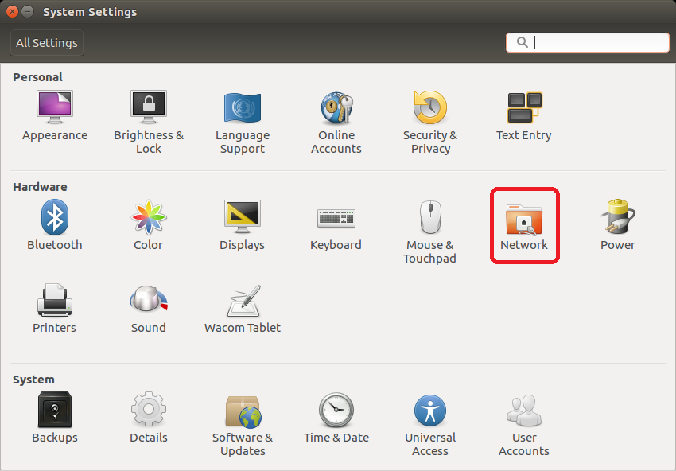
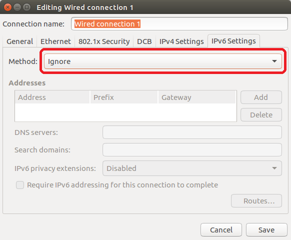
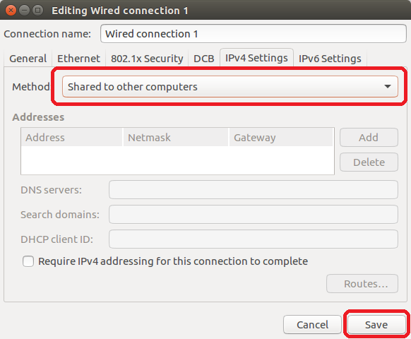
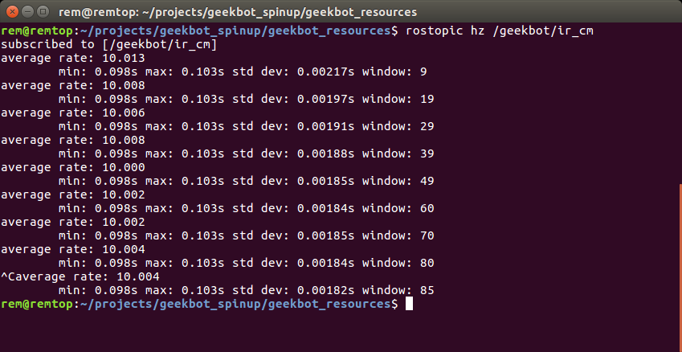
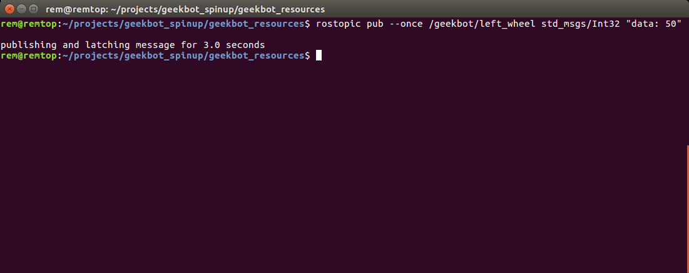
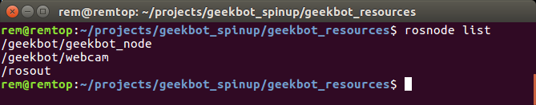
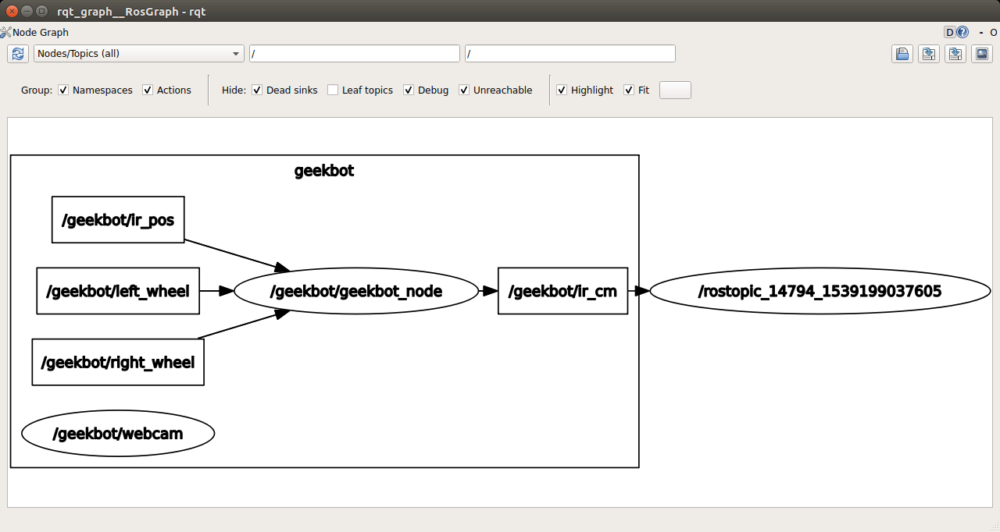
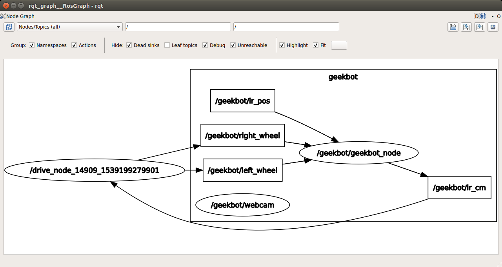

==================
Trossen GeekBots
==================

In the course of this text we have seen several different robot topologies but have focused a significant amount of time on the simple differential-drive robot. To accompany the text a basic differential-drive robot has been developed and deployed. The donor chassis for this specific design is the (now defunct) RobotGeeks GeekBot, from which we will appropriate a name. The GeekBot as constructed for use with this text has been developed with cost in mind: total parts cost comes in at just below $300. A 3D printer was used to print one mount for the SBC as well as a mount for the infrared sensor. All files will be made available online for the aspiring roboticist.

The purpose of the SDSMT GeekBot is to teach the basics of robot control using ROS on physical hardware. To accomplish this task the familiar RobotGeeks GeekBot platform was used as a mobile base and extra hardware added as needed.

Hardware:
---------
Locomotion
~~~~~~~~~~
The GeekBot comes stock with two drive wheels, powered by 6v continuous-rotation hobby servos. Two caster balls keep the bot vertical with a bit of wobble. These motors are not encoded, meaning they only have relative speed adjustment. The actual angular velocity of the wheels is unknown at any point other than stopped. Important: these motors are run directly off the unregulated input power supply. These motors will cook if supplied with more than ~8.5v.

Electrical
~~~~~~~~~~
The GeekBot is supplied by an 8.4v 2.2Ah LiPo battery. This is 8.4v is passed straight to the drive motors, the onboard Arduino, and a 5v regulator for supplying the Odroid XU4. The harness switches power to the system, and a disconnect is located on the back to decouple battery power and allow the use of another <9v supply for testing.

Sensors
~~~~~~~
The GeekBot has two sensors: a front-mounted webcam and a servo-actuated IR distance sensor. The IR sensor is mounted under the front of the robot and centered forward; the full range of motion encompasses 0-180 degrees. This sensor returns a non-linear analog voltage corresponding to perceived distance that is passed to the onboard Arduino and processed. The mounted webcam is is both powered by and communicates over one of the Odroid's USB ports. This particular webcam is manual focus and captures at 640x480px, 30fps.

Compute and control
~~~~~~~~~~~~~~~~~~~
The GeekBot follows a standard distributed-control topology: a high-level controller issues commands to low-level controllers which handle command implementation for specific subsystems. In this case, the high-level controller is an Odroid XU4 running a minimal version of Ubuntu 16.04 LTS. All hardware interfacing tasks (driving servos, reading voltages, turning lights on) are controlled by the Arduino, taking commands from the Odroid via UART. Below you can see a quick graphic showing these interconnects.

.. image:: figures/geekbot/graphics/comm_graphic.png
	:align: center
	:width: 75%

You will note that there are many, many places for communication failures (cut wires, unplugged cables, etc.) in this setup. Unfortunately this is one of the downfalls of real robotics; communications will eventually fail and you will have to have systems in place to guarantee correct data transfer or robot sutdown. For now, and at our own risk, we'll assume that there will be no communication interruptions in the GeekBot system. 

Software:
---------
ROS Kinetic
~~~~~~~~~~~
Despite the rest of the text using ROS2 Ardent, the GeekBot runs ROS1 Kinetic. The reasoning behind this decision pertains mostly to the lack of documentation, compressed image transport, networking tools, and debugging tools in ROS2 as of publishing time. The concepts presented in this text for ROS2 are directly transferable to ROS Kinetic. Nodes run independently of each other and communicate via passing messages over topics, exactly like ROS2. ROS1, however, does have a supervisory piece of software called ``roscore`` which handles node connections and message direction.

Software architecture
~~~~~~~~~~~~~~~~~~~~~
On boot the GeekBot ROS subsystem starts up three things: roscore, for handling all communications; a node to handle webcam things (webcam), and another node to handle communication with the Arduino (geekbot_node). Both exist under the ``/geekbot`` namespace. Using ROS' node/topic mapping tool ``rqt_graph`` we can see the GeekBot's nodes, topics, and the namespace under which all of these exist.

.. image:: figures/geekbot/graphics/geekbot_nodes.png
    :align: center
    :width: 75%

Bringup on boot is handled by a service through ``systemd`` that points to a script contained in the ``geekbot_pkg`` package which resides within the ``geekbot_ws`` directory in the ``/root`` directory of the Odroid's filesystem. Handling bringup through ``systemd`` allows for synchronization with the networking stack as well as an easy start-stop-restart interface so the GeekBot's ROS system can be restarted with the robot powered up and online. Linking to a ``systemd`` service in a repository-held package gives the option for updates to bringup handling without requiring extensive filesystem rework. Using a ``systemd`` service to start ROS systems on boot is much less common than simply pushing a start script to ``init.d``, ``rc.local``, or ``cron`` and is certainly more work to set up. However, using ``systemd`` allows for much simpler logging/debugging, runtime adjustments to the underlying ROS subsystem, and (most importantly) hardware-specific startup criterion using ``udev`` rules to adjust targets. We won't get into implementing such things here.   

Published topics
~~~~~~~~~~~~~~~~
After being powered on and being assigned an IP address in the 10.42.0.X range the GeekBot will publish/subscripe to several topics. The topics we care about are as follows:

	**/geekbot/ir_cm**
  	 - Publishes: Int32
  	 - Distance to nearest object in centimeters as seen by the IR sensor

	**/geekbot/ir_pos**
  	 - Subscribes: Int32
  	 - Angle (0-180) at which to set the IR sensor's servo

	**/geekbot/left_wheel**
  	 - Subscribes: Int32
  	 - Relative speed (-100-100) at which to set the left wheel. Negative for reverse

	**/geekbot/right_wheel**
  	 - Subscribes: Int32
  	 - Relative speed (-100-100) at which to set the right wheel. Negative for reverse

	**/geekbot/webcam/image_raw**
  	 - Publishes: Image
  	 - Raw image from the camera, with zero compression of any kind. Very large message

	**/geekbot/webcam/image_raw/compressed**
  	 - Publishes: CompressedImage
  	 - Compressed frame from the camera, 85% JPEG quality. MUCH smaller than raw image

GeekBot Basics:
-------------------
Initial setup
~~~~~~~~~~~~~
On a Ubuntu 16.04 LTS installation install ROS Kinetic alongside your ROS2 Ardent installation. Follow the `instructions <http://wiki.ros.org/kinetic/Installation/Ubuntu/>`_ to install ``ros-kinetic-desktop``. *HOWEVER*, do **not** add the excerpt as specified in step 1.6. Doing so will cause conflicts with your ROS2 Ardent installation. A few other packages will have to be installed to meet setup script dependencies and break out some image tools:

    ``sudo apt install nmap ros-kinetic-image-view ros-kinetic-image-common ros-kinetic-image-transport-plugins ros-kinetic-cv-bridge``

Next, clone the ``geekbot_resources`` repository found `here <https://github.com/sdsmt-robotics/geekbot_resources/>`_ to somewhere in your filesystem:

    ``git clone https://github.com/sdsmt-robotics/geekbot_resources``

You should now have a ``geekbot_resources`` directory. This repository contains all client-pc information pertaining to GeekBot operation. Inside you'll find notes and handy examples as well as the Arduino code running on the GeekBot's onboard controller.

Configuring your Ethernet port
~~~~~~~~~~~~~~~~~~~~~~~~~~~~~~
1. In Ubuntu's system settings, navigate to the 'Networking' section. You should see a list of network connections on the left side.

2. Select the wired network and in the lower-righthand side of the pane click 'Options'. Here we can change specific settings for how Ubuntu handles the Ethernet port of your computer. 

.. image:: figures/geekbot/eth_config/network_wired.png
    :align: center
    :width: 50%

3. Click on the IPv6 tab. In the drop down, select 'Ignore'. We won't be using IPv6 to connect to the GeekBots.

4. Now select the IPv4 tab and choose 'Share to other computers' from the dropdown menu. In the lower right hand corner click 'Save'.

The Ethernet port on your computer is now set to automatically assign an IP on 10.42.0.X spectrum to anything connected to it and requesting an IP address. This is the default state of the GeekBot, so if the GeekBot is connected to your computer then it will request and be assigned an IP in the 10.42.0.X range.

Connecting to the GeekBot
~~~~~~~~~~~~~~~~~~~~~~~~~
1. Connect an Ethernet cable between your computer and the GeekBot's Odroid.
2. Power on the GeekBot by flipping the switch in the left-rear of the bot outwards. The Odroid and Arduino should start flashing lights.
3. Wait patiently for the Odroid to boot. This should take ~30 seconds. When the Odroid has finished the booting process and has grabbed an IP from your computer, it will launch its ROS system and initiate communications with the onboard Arduino. If a successful connection is made *you will hear two beeps from the robot*.
4. Navigate to the geekbot_resources folder you cloned in the initial setup. Source the ``geekbot_connect.source`` file. This will use ``nmap`` to scrape the 10.42.0.X subnet looking for your bot, set the necessary environment variables, and automatically load in ROS Kinetic to this specific terminal instance.
5. If you see a list of topics print out to your terminal you have successfully connected! **You will have to follow step #4 for each terminal instance you would like to connect to the GeekBot.**

Shutting down the GeekBot
~~~~~~~~~~~~~~~~~~~~~~~~~
1. Flip the power switch in the left-rear of the bot forward, into the robot. If the power is off no lights should be on.

Charging the GeekBot
~~~~~~~~~~~~~~~~~~~~
1. Locate your GeekBot battery charger. This is a wall-wart supply that has a ribbed back section, a little LED in the bottom left corner, a yellow tip, and an 8.4v 2A output.
2. Plug the charger into an outlet.
3. Locate the battery charging port on the front of the robot. This should be zip-tied down to the lower platform and will run directly into the battery.
4. Plug in the charger to the charging port. The light on the charger should become red. When fully charged, the light will turn green. These batteries have automatic over-voltage protection, so the charger can be left on the battery indefinitely.

Running the GeekBot from external power
~~~~~~~~~~~~~~~~~~~~~~~~~~~~~~~~~~~~~~~
1. Make sure the GeekBot is powered off.
2. Disconnect the battery from the 2x5.5mm splitter zip-tied to the rear-right vertical support on the bot. Connect a power supply from 7v-8.5v, or the battery charger provided with the robot.
3. If the charger for the battery is used be aware: this supply does not provide enough power to run both motors as well as intense computation on the Odroid. If your robot is intermittently losing connection when operating the motors with this supply you are most likely browning out the Odroid.

Using the GeekBot:
------------------
ROS' in-built tools
~~~~~~~~~~~~~~~~~~~
When debugging ROS-based systems it can be very handy to peek in on what data is being published on what topics by what nodes. We can accomplish this easily with ROS' in-built command line tools. In ROS1 these take the form of ``rosxxxx`` where ``xxxx`` roughly describes the useful area of ROS within which we want to operate. For example, listening in on a topic and pushing its published info to the screen can be accomplished by using the ``rostopic`` tool:

    ``rostopic echo /geekbot/ir_cm``

Running the above you should see something like this on your screen: 

.. image:: figures/geekbot/repo_usage/echo_ir.png
    :align: center
    :width: 70%

The data presented is the Int32 payload published to the topic ``/geekbot/ir_cm``. Maybe we want to see how fast new information to this topic is being published. To do so we use the ``rostopic`` tool yet again:

    ``rostopic hz /geekbot/ir_cm``

You should now see the average publishing rate, calculated standard deviation for the publishing gap times, and also the number of samples the stats were generated from:

It looks like the IR data is coming in at exactly 10hz as expected. Neat!  

We can also publish to a topic using the command line, using the ``rostopic pub`` command. Tab-complete is very handy here. If ``rostopic`` can't automatically find a list of topics you can manually list registered topics with ``rostopic list`` and find the topic type with ``rostopic type``. Usually slapping the tab key will give you options or autofill. To publish a single message setting the left wheel speed of our GeekBot to 50% power, the command would look like the following:
	
    ``rostopic pub --once /geekbot/left_wheel std_msgs/Int32 "data: 50"``

This will publish to the topic one message with the payload as described:

Your GeekBot's left wheel should start spinning! Remember: since we only published a single message that wheel will keep spinning until we set the speed back to zero. For more complex messages, let tab-complete do the hard YAML work for you, then plug in your values. The following example call uses a six-field Twist message, which the Geekbots do not use:

::
	 
    rostopic pub --once /takes_a/twist_msg geometry_msgs/Twist \
	"linear:
       x: 1.3
       y: 0.0
       z: 0.0
	angular:
       x: 0.0
       y: 3.7
       z: 0.0"

We can also list the nodes currently running and tracked by the GeekBot's ``roscore``:
	
	``rosnode list``

This shows the three nodes running in the GeekBot's namespace: geekbot_node, webcam, and rosout. Wouldn't it be neat if we could easily visualize what nodes were running and over what topics they were communicating? ROS has a tool for this! In one terminal echo the output of the topic ``/geekbot/ir_cm``: 
  	
  	``rostopic echo /geekbot/ir_cm``

In another, use ``rosrun`` to run the ROS tool ``rqt_graph``:
  	
	``rosrun rqt_graph rqt_graph``

This will run the pre-installed 'node' ``rqt_graph`` in the package ``rqt_graph`` and generate a topic/node map! You should see something like this:

You can see the ``/geekbot`` namespace contains two nodes and several topics. The node that exists outside of the ``/geekbot`` namespace is the node created by ``rostopic echo``. ``geekbot_node`` publishes messages to the ``/geekbot/ir_cm`` topic, and the ``/rostopic_.........`` node is subscribed to this topic. The arrows indicate message flow. ``rqt_graph`` is  a very handy tool for debugging and conceptualizing ROS systems. For large systems it is a necessity!

Sensor-driven motion
~~~~~~~~~~~~~~~~~~~~
Inside the ``geekbot_resources/examples/python_examples/basic_ir`` directory you should see a file named ``ir_drive.py``. This script contains:

.. code:: python

	#!/usr/bin/env python
	import rospy
	from std_msgs.msg import Int32

	left_pub = rospy.Publisher('/geekbot/left_wheel', Int32, queue_size=10)
	right_pub = rospy.Publisher('/geekbot/right_wheel', Int32, queue_size=10)
	
	def callback(data):
	   	rospy.loginfo(rospy.get_caller_id() + " IR: %s", data.data)
	   	if data.data < 15:
	       	print("Driving forward.")
	       	msg = Int32()
	       	msg.data = 50
	       	left_pub.publish(msg)
	       	right_pub.publish(msg)
	   	else: 
	   	    print("Too far! Stop!")
	   	    msg = Int32()
	   	    msg.data = 0
	   	    left_pub.publish(msg)
	   	    right_pub.publish(msg)
		
	def listener():
	    rospy.init_node('drive_node', anonymous=True)
	    rospy.Subscriber("/geekbot/ir_cm", Int32, callback)
	    rospy.spin()
	
	if __name__ == '__main__':
	    listener()
    
All this code does is instantiate a ROS node that subscribes to the ``/geekbot/ir_cm`` topic and publishes wheel speeds based on the distance to the nearest object as determined by the front-mounted IR sensor. When run on your computer the GeekBot should sit patiently until you hold your hand within 15cm of the IR sensor. Then, it will drive forward! This is reversed logic from what we often want (drive until something gets in the way), but this way the GeekBot won't drive off your desk the moment the code starts executing. Consider this a friendly reminder to always prop up your robots so the wheels are off the ground when testing motion code. 

Plotting the ROS graph with ``rqt_graph`` shows us that, indeed, the ``ir_drive`` node is indeed subbed to one topic and publishing to both wheels:

Basic computer vision
~~~~~~~~~~~~~~~~~~~~~
Inside the ``geekbot_resources/examples/python_examples/basic_cv`` directory you should see a file named ``hsv_detect.py``. This script contains a bit too much code to prudently list here, so please open it in your editor of choice and read along. An online copy can be found on `this <https://github.com/sdsmt-robotics/geekbot_resources/blob/master/examples/python_examples/basic_cv/hsv_detect.py>`_ repo page. **BE WARNED** There's a bug in Python2.7's muli-threading library that is known and will not be fixed. More info in the code itself. *Expect crashes.* 

This code demonstrates 'elementary' computer vision capability using OpenCV to process images communicated over a ROS-based image stream. To use it you will need to install the ``cv_bridge`` package to convert between ROS CompressedImage messages and an image format OpenCV understands:
     
    ``sudo apt install ros-kinetic-cv-bridge``

With the bridge installed we can run the script. Upon running you should see two windows: in one a camera stream from the GeekBot, the other a black image. Move the 'maximum' sliders around. You should see pieces of the camera feed start to come into frame and maybe a few rectangles popping up. Set a high-color object in the camera's field of view and adjust the sliders to home in on just this color. Blues and yellows work well for this. With a bit of tinkering you should see something like this:

.. image:: figures/geekbot/repo_usage/cv_detect.png

You will notice that the rectangle on screen is now bounding the object with a red circle drawn in the center of the rectangle. Hooray: object tracking by color extraction!

Here's a rough rundown of what's happening in the code, starting at initial execution:

    1. Create an object_tracker object, initialize the node and start processing
    2. When an image is published to the ``/geekbot/webcam/image_raw/compressed`` topic, convert it for OpenCV use
    3. Make a copy of the original image and convert this copy to `HSV <https://en.wikipedia.org/wiki/HSL_and_HSV>`_ from RGB
    4. Threshold the HSV copy by the min and max values determined from the sliders. This returns a binary mask
    5. Denoise the mask with a series of dilations and erodes
    6. Find all connected contours in the mask. These contours are individual blobs in the mask
    7. Given a contour, generate a bounding rectangle for the contour. If the bounded area is too small, reject the rectangle
    8. Given a list of all viable bounding rectangles, find the largest
    9. Bitwise AND the adjusted mask with the original image. This will block anything not captured in the mask
    10. Draw the largest rectangle (and its center) on on the now-reduced original image
    11. Display all images to their respective windows

The code might look intimidating off the cuff but it really is this straightforward. Conversion to the HSV colorspace is necessary to produce a consistent color lock regardless of color brightness. A quick online search will yield a variety of explanations that will be far more useful than any discussion of HSV's merits for computer vision in this text.

Notice that this code tracks the center of a bounding box. For the most part this center will be near the centroid of a tracked object. Using this information our GeekBot could be configured to automatically turn itself when a tracked object gets too close to the edge of the frame. The implementation of this (and other computer vision adventures) is left to the reader.    