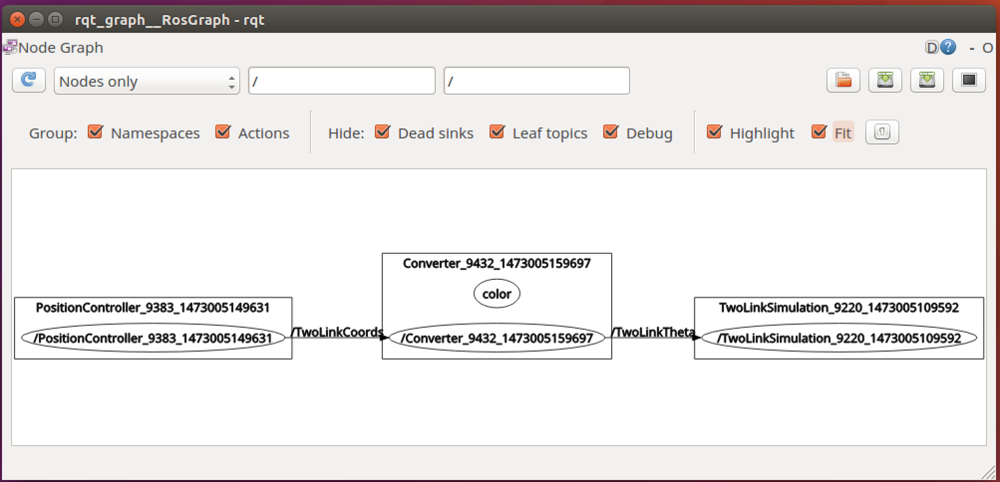
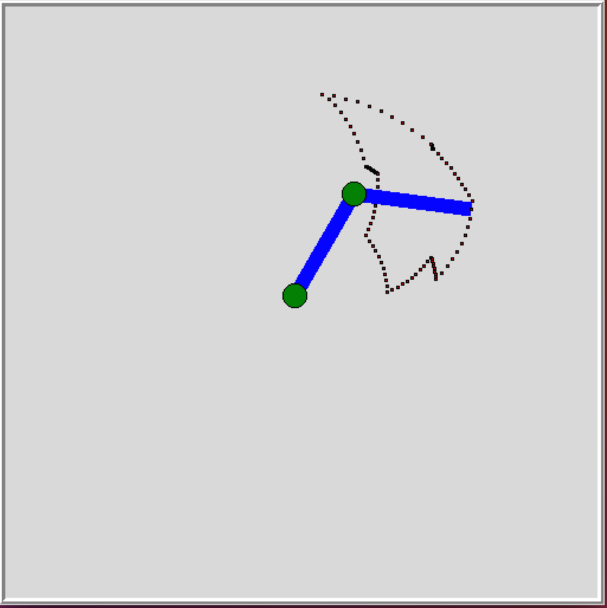

Simulating Motion
-----------------

As stated before, producing motion is not difficult. Deciding on the
correct actions and controlling the system are the more challenging
aspects. The first is known as *Motion Planning* or just *Planning* and
the second is called *Controls*. To get started we will borrow
algorithms from nature since we see so many successful autonomous agents
in the biological world. Worms and insects are very successful animals.
They can sense the world and move around in it. We can borrow from
notions in physics and chemistry when we see simple systems moving in
constrained manners. The simplest solution is the best solution. It is
best to use no more components or technology than necessary. Beyond
basic elegance is the fact that the more components something has, the
greater probability the system will fail. This is true in our
simulations as well.

We return to the two examples in the previous section, the Two Link
Manipulator and the Mobile Disk Robot. Using these two systems, we will
introduce methods to simulate motion. These very basic systems can be
used as the prototypes for developing a simulation and for the simple
motion planning algorithms.

You can download the simulators by following the links on D2L. To get
started, again you need to be in your Ubuntu session and run the ROS
Master:

::

    >  roscore

You can run the Two Link Manipulator simulator we will use by typing

::

    >  python twolinksimple.py

and you should see what is indicated in
:numref:`Fig:twolinksimulator1`-(a). In
another terminal, run Python and type

::

    >>> import rospy
    >>> from std_msgs.msg import String
    >>> pub = rospy.Publisher('TwoLinkTheta', String, queue_size=10)
    >>> rospy.init_node('talker', anonymous=True)
    >>> message = "20:10:0"
    >>> pub.publish(message)

.. figure:: SimulationFigures/twolinksimulator1.png
   :width: 60%
   :align: center

   The two link simulator.

.. figure:: SimulationFigures/twolinksimulator2.png
   :width: 60%
   :align: center

   Published angle to the simulator.

You should see the link arm move as shown in
:numref:`Fig:twolinksimulator1`-(b). The
API is very simple. You need to publish a string formatted as
"theta1:theta2:pen". The values theta1 and theta2 are in degrees (int or
float), and pen is an int. Pen is set to 1 to draw and 0 to not draw.
The program DialCntrl.py is an example of a Tk widget that uses two
sliders to set the angle,
:numref:Fig:tksliderexample` (a). To gain
an understanding of the ROS Node structure, one may list out the ROS
nodes (example, your numbers will vary):

::

    rosnode list
    /DialController_5943_1473004072330
    /TwoLinkSimulation_5785_1473004028541
    /rosout

To view the resulting node graph we can use the ROS tool rqt_graph:

::

    rosrun rqt_graph rqt_graph

In this case it produces Figure \ `[Fig:rosgraph0] <#Fig:rosgraph0>`__.

.. _`Fig:rosgraph0`
.. figure:: SimulationFigures/rosgraph0.png
   :width: 60%
   :align: center

   The ROS Node Graph Tool rqt_graph.

If you are curious about the messages flowing on a topic, recall ROS can
echo those to a terminal for debugging purposes. In a free terminal,
type

::

    rostopic echo /TwoLinkTheta

The move one of the sliders. You will see the message on the
TwoLinkTheta topic echoed. If you have source code you can clearly print
out the messages. It is nice to see what is actually going across. If
you don’t have source code, then this tool is very handy.

A Tk control that can set position is given in the next example
PositionCntrl.py and shown in
:numref:`Fig:tksliderexample` (b). The
widget PositionCntrl.py publishes :math:`(x,y)` coordinates. An
intermediate node IK.py is used to convert the :math:`(x,y)` values to
:math:`(\theta_1, \theta_2)` and these values are published to the Two
Link Simulator.

.. _`Fig:tksliderexample`:
.. figure:: SimulationFigures/tksliderexample.png
   :width: 60%
   :align: center

   The servo angle control widget

.. _`Fig:tksliderexample2`>:
.. figure:: SimulationFigures/tksliderexample2.png
   :width: 60%
   :align: center

   The position control
   widget

::

    # Libraries
    from math import *
    import rospy
    from std_msgs.msg import String

::

    # Call back function
    def capture(data):
        var = data.data.split(":")
        x = float(var[0])
        y = float(var[1])
        a1 = float(var[2])
        a2 = float(var[3])
        pen = int(var[4])
        inverse(x,y,a1,a2,pen)

::

    # Compute IK and send to simulator
    def inverse(x,y,a1,a2,pen):
        if (sqrt(x*x+y*y) > a1+a2):
          print "(x,y) out of reach for links"
        else:
          d =  (x*x+y*y-a1*a1-a2*a2)/(2.0*a1*a2)
          t2 = atan2(-sqrt(1.0-d*d),d)
          t1 = atan2(y,x) - atan2(a2*sin(t2),a1+a2*cos(t2))
          dt1 = (180.0*t1/pi)
          dt2 = (180.0*t2/pi)
          print x,y, dt1, dt2
          sliders = str(dt1) + ':' + str(dt2) + ':' + str(pen)
          pub.publish(sliders)

::

    # ROS management
    pub = rospy.Publisher('TwoLinkTheta', String, queue_size=10)
    rospy.init_node('Converter', anonymous=True)
    rospy.Subscriber("TwoLinkCoords", String, capture)
    rospy.spin()

.. _`Fig:rosgraph1`

   The ROS Node Graph Tool rqt_graph.

Animation of the Two Link Manipulator
-------------------------------------

[example_twolinkmanipulator] For the arm in the two link example,
determine the joint angles to trace out a circle centered at (10,8) of
radius 5. The circle can be parametrized by
:math:`x(t) = 5\cos (t) + 8`, :math:`y(t) = 3 \sin(t) + 10`,
:math:`-\pi \leq t \leq \pi`. Generate an array of points on the circle
and plug them into the inverse kinematics.

Bring up the two link simulator. Then run the following code in Python.
You should see an animation of the two link arm drawing a circle. The
final position is given in
:numref:`Fig:twolinkcircleexample`.

::

    # Bring in libraries
    import rospy
    from std_msgs.msg import String
    import numpy as np
    import time
    from math import *

::

    #Setup Arrays
    step = 0.1
    t = np.arange(-pi, pi, step)
    x = 5.0*np.cos(t) + 8.0
    y = 3.0*np.sin(t) + 10.0

::

    #Initialize variables
    a1 = 10.0
    a2 = 10.0
    d = (x*x + y*y - a1*a1 - a2*a2)/(2*a1*a2)
    t2 = np.arctan2(-np.sqrt(1.0-d*d),d)
    t1 = np.arctan2(y,x) - np.arctan2(a2*np.sin(t2),a1+a2*np.cos(t2))

::

    # Setup ROS and publish joint data
    pub = rospy.Publisher('TwoLinkTheta', String, queue_size=10)
    rospy.init_node('talker', anonymous=True)

    for i in range(t.size):
       print t1[i], "  ", t2[i]
       m = str(180*t1[i]/np.pi) + ":" + str(180*t2[i]/np.pi) + ":" + str(1)
       time.sleep(0.25)
       pub.publish(m)

.. _`Fig:twolinkcircleexample`:
.. figure:: SimulationFigures/twolinkcircleexample.png
   :width: 60%
   :align: center

   The output of the circle inverse kinematics
   code.

In this example, we generate an array named t which is used for the
parametric equations of the circle to generate the x and y arrays. We
may use the inverse kinematic formulas to determine the arrays for
:math:`\theta_1` and :math:`\theta_2` called t1 and t2. The
:math:`\theta_1` and :math:`\theta_2` would be the values sent to the
joint actuators.
:numref:`Fig:twolinkcircleexample`
shows the results.

You can modify the data arrays to plot a line:

::

    #Setup Arrays
    t = np.arange(-5, 8, step)
    x = t
    y = x + 5

The inverse kinematics can be placed into a separate ROS node. The
driving program follows (same headers as before). To connect to the
simulation program, we use the inverse kinematics node as before

::

    #Setup Arrays
    a1 = 10
    a2 = 10
    step = 0.1
    t = np.arange(-pi, pi, step)
    x = 5.0*np.cos(t) + 8.0
    y = 3.0*np.sin(t) + 10.0

    pub = rospy.Publisher('TwoLinkCoords', String, queue_size=10)
    rospy.init_node('talker', anonymous=True)

    for i in range(t.size):
       locs = str(x[i]) + ":" + str(y[i]) + ":" + str(10) + ":" + str(10)
                       +":" + str(1)
       time.sleep(0.25)
       pub.publish(locs)

.. figure:: SimulationFigures/twolinkcoarseexample.png
   :width: 60%
   :align: center

    Movement between the points - moving both linearly.

.. _`Fig:twolinkcoarseexample`:

    Movement between the points - moving the servos sequentially.

This simulation gives an idea about how to move the robotic arm and the
path is correct. The motion however is not smooth. This is because we
are moving the arm from position to position. This is known as position
control. If you look at the curve produced, it is not a smooth curve but
is a curve made of of connected segments like a polygon,
:numref:`Fig:twolinkcoarseexample`.
Note that the output is not actually a polygon; the sides are not
straight line segments.

In between the control points, the system moves according to how the
controllers are programmed. They will move the joint angles in a linear
fashion. If they are moved together you will see
:numref:`Fig:twolinkcoarseexample`(a).
If they are moved one at a time you will see
:numref:`Fig:twolinkcoarseexample`(b).
